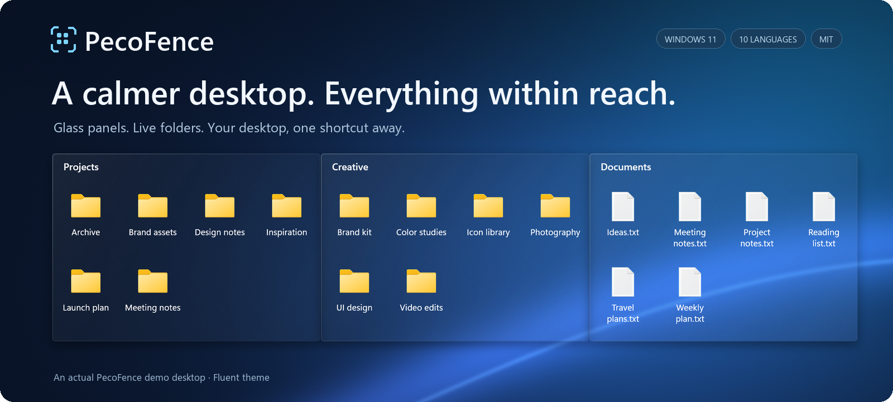

<p align="center">
  
</p>


<p align="center">
  <strong>A free, open-source Stardock Fences alternative for Windows 11.</strong><br>
  Make room for what matters. Organize files in glass panels, switch projects with tabs and bring your desktop into reach with one shortcut. Free and open source. Or just ask your AI agent to do it.
</p>

<p align="center">
  <a href="https://pecofence.jiang.jp/"><strong>Website</strong></a>
  &nbsp;·&nbsp; <a href="#get-pecofence"><strong>Get PecoFence →</strong></a>
  &nbsp;·&nbsp; <a href="#see-it-in-action">See it in action</a>
  &nbsp;·&nbsp; <a href="#ask-your-ai-to-organize-it">AI agents</a>
  &nbsp;·&nbsp; <a href="docs/README.md">Documentation</a>
</p>

<p align="center">
  <strong>English</strong>
  &nbsp;·&nbsp; <a href="docs/readme/README.zh-CN.md">简体中文</a>
  &nbsp;·&nbsp; <a href="docs/readme/README.zh-TW.md">繁體中文</a>
  &nbsp;·&nbsp; <a href="docs/readme/README.ja.md">日本語</a>
  &nbsp;·&nbsp; <a href="docs/readme/README.ko.md">한국어</a>
  &nbsp;·&nbsp; <a href="docs/readme/README.de.md">Deutsch</a>
  &nbsp;·&nbsp; <a href="docs/readme/README.fr.md">Français</a>
  &nbsp;·&nbsp; <a href="docs/readme/README.es.md">Español</a>
  &nbsp;·&nbsp; <a href="docs/readme/README.pt-BR.md">Português (Brasil)</a>
  &nbsp;·&nbsp; <a href="docs/readme/README.ru.md">Русский</a>
</p>

---

## Give everything a place

Projects, screenshots, things to read later—keep them in their own groups, arranged
the way you work. PecoFence adds just enough structure to make your desktop useful again.

| **Group your work** | **Keep folders close** | **Clear some space** |
| :--- | :--- | :--- |
| Make a fence for each project. Drag, resize and snap it into place. | Put a live folder on your desktop. Browse subfolders and see changes as they happen. | Double-click the desktop to hide your groups. Double-click again to bring them back. |

## See it in action

https://github.com/user-attachments/assets/6320cf28-a791-4720-9659-b4575df021a0

### One window. Multiple workspaces.

Keep related groups together as tabs. Switch from Work to Art in a click,
then drag a tab out when you want the extra room.


### Your desktop, one shortcut away.

Press **Ctrl + Alt + Space** to bring your fences above the current application.
Grab what you need, then press **Esc** to return.


<sub>Recorded in PecoFence using demo files and the Fluent theme. GIFs loop automatically.</sub>

## Small details, better everyday use

| Experience | What you get |
| :--- | :--- |
| **Less sorting** | Rules for file types, extensions, names, wildcards, shortcut targets, time and size. New files find their group automatically. |
| **Glass that fits your desktop** | Fluent and Liquid Glass themes, light/dark modes, per-fence colors, opacity and icon tinting. |
| **Familiar file handling** | Explorer context menus, drag and drop, copy/paste, multi-select, thumbnails and icon/list/details views. |
| **Space when you need it** | Roll a fence up to its title. Hover to expand. Lock a layout you like. |
| **A way back** | Layout snapshots, daily backups, configuration import/export and display swapping. |
| **A small footprint** | A native Rust application; the WebView2 settings panel loads on demand. |
| **Works with your AI agent** | `pecofence-cli` speaks JSON, so Claude Code, Codex or Cursor can build fences, move icons and write rules for you. |

Automatic organizing rules keep files in their original locations. File moves you
initiate work like they do in Explorer.

[Explore the complete feature list →](docs/FEATURES.md)

## Ask your AI to organize it

PecoFence ships `pecofence-cli`, a command line built for AI coding agents such as Claude Code, Codex and Cursor. Every command speaks JSON, reports whether anything actually changed and explains errors in a way an agent can act on. You describe the desktop you want; the agent runs the commands.

> "Put all my PDFs into a Docs fence, keep it that way, and make the fences a bit more transparent."

```
pecofence-cli snapshot save before-cleanup
pecofence-cli fence create --title Docs --rect 100,100,600,400
pecofence-cli rule add --name PDFs --ext pdf --to Docs
pecofence-cli rule apply
pecofence-cli fence set --all opacity clear
```

Fences, icons, rules, settings, snapshots and configuration files are all reachable, and every step can be undone from a layout snapshot. To get your agent started, run `pecofence-cli skill` and save the output into its skills folder, or paste the three-line snippet it prints into your `AGENTS.md`. The Microsoft Store edition puts `pecofence-cli` on your PATH; the portable ZIP runs it from its own folder.

[Command-line reference →](docs/CLI.md)

## Speaks your language

**English · 简体中文 · 繁體中文 · 日本語 · 한국어**  
**Deutsch · Français · Español · Português (Brasil) · Русский**

Switch instantly in **Settings → General → Display language**, or follow Windows.
All translations are included and work offline. Your filenames and custom names are preserved.

## Get PecoFence

<a href="https://apps.microsoft.com/detail/9MV6WG3XNWSX?mode=direct"></a>

The Microsoft Store edition is signed by Microsoft, updates automatically and never shows a SmartScreen prompt. Prefer a plain ZIP? The portable build below is the same app.

1. Open this repository's **Releases** page and download `pecofence-<version>-x64.zip`.
2. Extract the **whole ZIP** into a folder and run `pecofence.exe`.
3. Start organizing. Right-click the tray icon whenever you need Settings or want to exit.

Prefer a package manager? `winget install DayuanJiang.PecoFence` installs the same portable build and skips the SmartScreen prompt.

**Windows 11 x64 · Portable ZIP · No account required · Apache 2.0 licensed**

The first launch creates Programs, Folders, Files and documents, and Desktop groups
in your selected language. Windows desktop icons are restored when you exit.

<details>
<summary><strong>Requirements, configuration and a few useful notes</strong></summary>

- Designed for Windows 11 22H2 and later. Most native testing has been on 25H2;
  the full older-version and multi-display hardware matrix is still in progress.
- Microsoft Edge WebView2 Runtime is required for Settings. Keep the bundled
  `WebView2Loader.dll` and `pecofence-watchdog.exe` beside the app.
- Configuration lives in `%APPDATA%\PecoFence\config.json`. Launch with
  `--portable` to keep it in a `config` folder beside the executable.
- Existing installations keep their previous configuration directory.
  See the [upgrade guide](docs/UPGRADING.md).
- Glass uses the static desktop wallpaper. It does not refract other applications
  or live video wallpaper.
- Windows-owned dialogs and third-party Explorer menu entries follow Windows' language.
- Portable builds are unsigned. If Windows SmartScreen appears on first launch, choose
  **More info → Run anyway**. Installing from the Microsoft Store or through winget avoids the prompt.

[Portable edition guide](docs/PORTABLE.md) · [Language guide](docs/LOCALIZATION.md)

</details>

## Build it. Make it yours.

PecoFence is Apache 2.0 licensed, and contributions are welcome—from a sharper translation
to a better desktop interaction.

[Contribute](CONTRIBUTING.md) · [Improve a translation](docs/LOCALIZATION.md) · [Development guide](docs/DEVELOPMENT.md)

<details>
<summary><strong>Build from source</strong></summary>

Install Rust stable and Visual Studio Build Tools with the C++ workload and Windows SDK.

```powershell
cargo build --locked --release
Copy-Item third_party/webview2/WebView2Loader.x64.dll target/release/WebView2Loader.dll
```

Create a distributable portable ZIP:

```powershell
./scripts/make-portable.ps1
```

The workspace is organized into `crates/` for the native app, `ui/` for Settings,
`locales/` for translations and `scripts/` for verification and packaging.
The product website lives in `site/`, and the optional video project in `extras/`
is independent of the app build.

[Release instructions](docs/RELEASING.md) · [Source layout](docs/DEVELOPMENT.md#architecture)

</details>

---

**Made for a desktop you enjoy coming back to.**  
[Apache License 2.0](LICENSE) · [Third-party notices](third_party/README.md)
