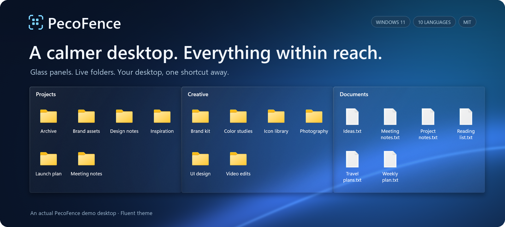

https://github.com/user-attachments/assets/c827f059-cfd7-4f6a-bed3-8b00411a7220

<p align="center">
  <strong>A free, open-source Stardock Fences alternative for Windows 11.</strong><br>
  Keep files in glass panels, switch projects with tabs, and ask your AI agent to configure the layout, appearance and sorting rules through the built-in CLI.
</p>

<p align="center">
  <a href="https://pecofence.jiang.jp/"><strong>Website</strong></a>
  &nbsp;·&nbsp; <a href="#get-pecofence"><strong>Get PecoFence →</strong></a>
  &nbsp;·&nbsp; <a href="#your-desktop-configured-by-your-ai"><strong>AI + CLI</strong></a>
  &nbsp;·&nbsp; <a href="#see-it-in-action">See it in action</a>
  &nbsp;·&nbsp; <a href="docs/README.md">Documentation</a>
</p>

<p align="center">
  <strong>English</strong>
  &nbsp;·&nbsp; <a href="docs/readme/README.zh-CN.md">简体中文</a>
  &nbsp;·&nbsp; <a href="docs/readme/README.zh-TW.md">繁體中文</a>
  &nbsp;·&nbsp; <a href="docs/readme/README.ja.md">日本語</a>
  &nbsp;·&nbsp; <a href="docs/readme/README.ko.md">한국어</a>
  &nbsp;·&nbsp; <a href="docs/readme/README.de.md">Deutsch</a>
  &nbsp;·&nbsp; <a href="docs/readme/README.fr.md">Français</a>
  &nbsp;·&nbsp; <a href="docs/readme/README.es.md">Español</a>
  &nbsp;·&nbsp; <a href="docs/readme/README.pt-BR.md">Português (Brasil)</a>
  &nbsp;·&nbsp; <a href="docs/readme/README.ru.md">Русский</a>
</p>

---

<a id="ask-your-ai-to-organize-it"></a>

## Your desktop. Configured by your AI

**Built-in CLI. Ready for your AI agent.**

Tell your AI agent how you want your desktop to work. The bundled `pecofence-cli` lets Claude Code, Codex and Cursor read your current setup and apply changes directly in PecoFence.

- **Configure it in your own words.** Change themes, transparency, icon sizes and global settings, or adjust every fence at once.
- **Organize once. Keep it organized.** Create project fences, arrange icons and add rules that sort new files automatically.
- **Save a setup you like.** Use snapshots for fence layouts and configuration export/import for settings, rules and layouts.

**Try it with your AI agent**

Open PecoFence, then paste this request into your AI coding agent:

> Use pecofence-cli to configure my desktop. First read pecofence-cli skill and pecofence-cli describe, then inspect my current settings and fences. Back up my configuration before changes. Switch to dark mode and make all fences more transparent.

The CLI is included. The Microsoft Store edition adds `pecofence-cli` to PATH. With the portable ZIP, give your agent the path to `pecofence-cli.exe`.

<details>
<summary><strong>Example conversation with a coding agent</strong></summary>

> Put my desktop PDFs in a Docs fence, keep new PDFs there, switch to dark mode and make the fences more transparent.

```powershell
pecofence-cli config export "$env:USERPROFILE\pecofence-before-ai.json"
pecofence-cli snapshot save before-cleanup
pecofence-cli fence create --title Docs
pecofence-cli rule add --name PDFs --ext pdf --to Docs --index 0
pecofence-cli rule apply
pecofence-cli settings set theme dark
pecofence-cli fence set --all opacity clear
```

</details>

Built for agents and scripts: `describe` exposes the command catalog and JSON Schemas; `skill` prints the agent guide. JSON results report what changed, and structured application errors help the agent choose its next step.

[Get started with the CLI →](docs/CLI.md#start-with-your-ai-agent)

## Give everything a place

<p align="center">
  
</p>

## See it in action

### One fence. Multiple workspaces.

Keep related fences together as tabs. Switch from Project to Ideas in a click,
then drag a tab out when you want the extra room.


### Your desktop, one shortcut away.

Press **Ctrl + Alt + Space** to bring your fences above the current application.
Grab what you need, then press **Esc** to return.


<sub>Animations from the <a href="https://pecofence.jiang.jp/manual/">user manual</a>. GIFs loop automatically.</sub>

## Small details that add up

| Feature | What you get |
| :--- | :--- |
| **AI + CLI** | `pecofence-cli` — **Configure it in your own words.** Change themes, transparency, icon sizes and global settings, or adjust every fence at once. |
| **Less sorting** | Rules for file types, extensions, names, wildcards, shortcut targets, time and size. New files find their fence automatically. |
| **Glass that fits your desktop** | Fluent and Liquid Glass themes, light/dark modes, per-fence colors, opacity and icon tinting. |
| **Familiar file handling** | File Explorer context menus, drag and drop, copy/paste, multi-select, thumbnails and icon/list/details views. |
| **Keep folders close** | Put a live folder on your desktop. Browse subfolders and see changes as they happen. |
| **Space when you need it** | Roll a fence up to its title. Hover to expand. Lock a layout you like. Double-click the desktop to hide your fences. Double-click again to bring them back. |
| **A way back** | Layout snapshots, daily backups, configuration import/export and swapping fences between displays. |
| **A small footprint** | A native Rust application that idles at about 40 MB of memory in Task Manager. The WebView2 settings panel loads on demand. |

Automatic sorting rules keep files in their original locations. File moves you
initiate work like they do in File Explorer.

[Explore the complete feature list →](docs/FEATURES.md)

## Get PecoFence

<a href="https://apps.microsoft.com/detail/9MV6WG3XNWSX?mode=direct"></a>

The Microsoft Store edition is signed by Microsoft, updates automatically and never shows a SmartScreen prompt. The same app also comes as:

- **Portable ZIP**: download `pecofence-v<version>-x64-portable.zip` from this repository's **Releases** page, extract the **whole ZIP** into a folder and run `pecofence.exe`.
- **Installer**: `pecofence-v<version>-x64-setup.exe` on the same page installs PecoFence for your Windows user, with a Start menu entry and an uninstaller.
- **winget**: `winget install DayuanJiang.PecoFence` installs the portable build and skips the SmartScreen prompt.

<details>
<summary><strong>Requirements, configuration and a few useful notes</strong></summary>

- Windows 11 22H2 or later. Settings needs the Microsoft Edge WebView2 Runtime.
- The first launch creates four fences in your selected language: Programs, Folders, Files and documents, and Desktop. Windows desktop icons are restored when you exit.
- Configuration lives in `%APPDATA%\PecoFence\config.json`. Launch with `--portable` to keep it in a `config` folder beside the executable.
- The ZIP and the installer are unsigned. If Windows SmartScreen appears on first launch, choose **More info → Run anyway**.

[Portable edition guide](docs/PORTABLE.md) · [Language guide](docs/LOCALIZATION.md) · [Windows installer guide](docs/INSTALLER.md)

</details>

## Build it. Make it yours.

PecoFence is Apache 2.0 licensed, and contributions are welcome—from a sharper translation
to a better desktop interaction.

[Contribute](CONTRIBUTING.md) · [Improve a translation](docs/LOCALIZATION.md) · [Development guide](docs/DEVELOPMENT.md)

---

**Made for a desktop you enjoy coming back to.**  
[Apache License 2.0](LICENSE) · [Third-party notices](third_party/README.md)

Thanks to the [LINUX DO](https://linux.do) community.
