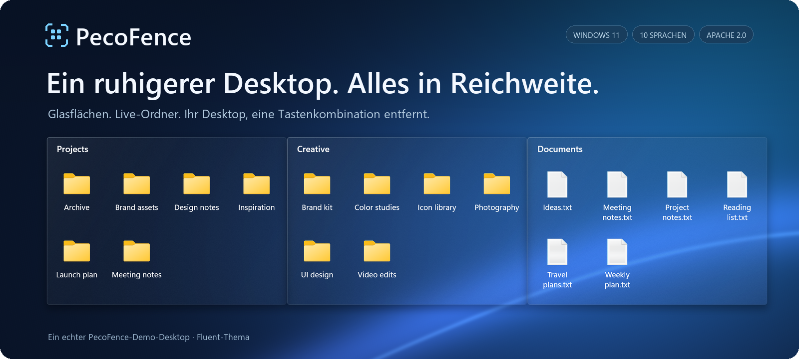

<p align="center">
  
</p>

https://github.com/user-attachments/assets/6320cf28-a791-4720-9659-b4575df021a0

<p align="center">
  <strong>Eine kostenlose Open-Source-Alternative zu Stardock Fences für Windows 11.</strong><br>
  Ordnen Sie Ihre Dateien in Glasflächen. Eine Tastenkombination holt sie über jede Anwendung.
</p>

<p align="center">
  <a href="#pecofence-herunterladen"><strong>PecoFence herunterladen →</strong></a>
  &nbsp;·&nbsp; <a href="#pecofence-in-aktion">In Aktion sehen</a>
  &nbsp;·&nbsp; <a href="../README.md">Dokumentation</a>
</p>

<p align="center">
  <a href="../../README.md">English</a>
  &nbsp;·&nbsp; <a href="README.zh-CN.md">简体中文</a>
  &nbsp;·&nbsp; <a href="README.zh-TW.md">繁體中文</a>
  &nbsp;·&nbsp; <a href="README.ja.md">日本語</a>
  &nbsp;·&nbsp; <a href="README.ko.md">한국어</a>
  &nbsp;·&nbsp; <strong>Deutsch</strong>
  &nbsp;·&nbsp; <a href="README.fr.md">Français</a>
  &nbsp;·&nbsp; <a href="README.es.md">Español</a>
  &nbsp;·&nbsp; <a href="README.pt-BR.md">Português (Brasil)</a>
  &nbsp;·&nbsp; <a href="README.ru.md">Русский</a>
</p>

---

## Alles bekommt seinen Platz

Projekte, Screenshots, Lesestoff für später – jedes bekommt seine eigene Gruppe, angeordnet
so, wie Sie arbeiten. PecoFence bringt gerade so viel Struktur auf den Desktop, dass er
wieder nützlich wird.

| **Arbeit gruppieren** | **Ordner in Reichweite** | **Platz schaffen** |
| :--- | :--- | :--- |
| Legen Sie für jedes Projekt einen Bereich an. Ziehen, skalieren und einrasten lassen. | Holen Sie einen Live-Ordner auf den Desktop. Stöbern Sie in Unterordnern und sehen Sie Änderungen sofort. | Ein Doppelklick auf den Desktop blendet alle Gruppen aus. Ein zweiter holt sie zurück. |

## PecoFence in Aktion

### Ein Fenster. Mehrere Arbeitsbereiche.

Halten Sie zusammengehörige Gruppen als Tabs beisammen. Wechseln Sie mit einem Klick
von Work zu Art, und ziehen Sie einen Tab heraus, wenn Sie mehr Platz brauchen.


### Ihr Desktop, eine Tastenkombination entfernt.

Drücken Sie **Ctrl + Alt + Leertaste**, um Ihre Bereiche über die aktuelle Anwendung zu holen.
Greifen Sie sich, was Sie brauchen, und kehren Sie mit **Esc** zurück.


<sub>Aufgenommen in PecoFence mit Demo-Dateien und dem Fluent-Thema. Die GIFs laufen in Endlosschleife.</sub>

## Kleine Details, die den Alltag leichter machen

| Erlebnis | Was dahintersteckt |
| :--- | :--- |
| **Weniger sortieren** | Regeln nach Dateityp, Endung, Name, Platzhalter, Verknüpfungsziel, Zeit und Größe. Neue Dateien finden ihren Bereich von selbst. |
| **Glas, das zu Ihrem Desktop passt** | Die Themen Fluent und Liquid Glass, heller und dunkler Modus, Farbton, Deckkraft und Symbolfärbung je Bereich. |
| **Vertraute Dateiverwaltung** | Explorer-Kontextmenüs, Drag & Drop, Kopieren/Einfügen, Mehrfachauswahl, Miniaturansichten sowie Symbol-, Listen- und Detailansicht. |
| **Platz, wenn Sie ihn brauchen** | Klappen Sie einen Bereich bis auf den Titel ein. Zum Ausklappen einfach darüberfahren. Sperren Sie ein Layout, das Ihnen gefällt. |
| **Ein Weg zurück** | Layout-Momentaufnahmen, tägliche Sicherungen, Import/Export der Konfiguration und Tausch zwischen Bildschirmen. |
| **Ein kleiner Fußabdruck** | Eine native Rust-Anwendung; die WebView2-Einstellungen werden nur bei Bedarf geladen. |

Automatische Sortierregeln lassen Dateien an ihrem ursprünglichen Speicherort. Verschiebungen,
die Sie selbst anstoßen, funktionieren wie im Explorer.

[Die vollständige Funktionsliste →](../FEATURES.md)

## Spricht Ihre Sprache

**Deutsch · English · 简体中文 · 繁體中文 · 日本語**  
**한국어 · Français · Español · Português (Brasil) · Русский**

Wechseln Sie jederzeit unter **Einstellungen → Allgemein → Anzeigesprache** oder übernehmen Sie
die Windows-Sprache. Alle Übersetzungen sind enthalten und funktionieren offline. Dateinamen
und eigene Bezeichnungen bleiben unverändert.

## PecoFence herunterladen

1. Öffnen Sie die **Releases**-Seite dieses Repositorys und laden Sie `pecofence-<Version>-x64.zip` herunter.
2. Entpacken Sie die **gesamte ZIP-Datei** in einen Ordner und starten Sie `pecofence.exe`.
3. Legen Sie los. Ein Rechtsklick auf das Taskleistensymbol öffnet die Einstellungen oder beendet PecoFence.

Lieber ein Paketmanager? `winget install DayuanJiang.PecoFence` installiert denselben portablen Build und überspringt die SmartScreen-Abfrage.

**Windows 11 x64 · Portable ZIP · Kein Konto nötig · Apache-2.0-Lizenz**

Beim ersten Start werden die Bereiche Programme, Ordner, Dateien und Dokumente sowie Desktop
in der gewählten Sprache angelegt. Beim Beenden erscheinen die Windows-Desktopsymbole wieder.

<details>
<summary><strong>Systemvoraussetzungen, Konfiguration und ein paar nützliche Hinweise</strong></summary>

- Entwickelt für Windows 11 22H2 und neuer. Die meisten nativen Tests liefen auf 25H2;
  die vollständige Matrix aus älteren Versionen und Multi-Monitor-Hardware ist noch in Arbeit.
- Für die Einstellungen wird die Microsoft Edge WebView2 Runtime benötigt. Lassen Sie die
  mitgelieferten `WebView2Loader.dll` und `pecofence-watchdog.exe` neben der App liegen.
- Die Konfiguration liegt in `%APPDATA%\PecoFence\config.json`. Mit `--portable` gestartet,
  bleibt sie in einem Ordner `config` neben der ausführbaren Datei.
- Bestehende Installationen behalten ihr bisheriges Konfigurationsverzeichnis.
  Siehe [Upgrade-Anleitung](../UPGRADING.md).
- Das Glas verwendet das statische Desktop-Hintergrundbild. Andere Anwendungen oder
  Video-Hintergründe werden nicht gebrochen.
- Windows-eigene Dialoge und Explorer-Menüeinträge von Drittanbietern folgen der Windows-Sprache.
- Portable Builds sind nicht signiert. Fragt Windows SmartScreen beim ersten Start nach, wählen Sie
  **Weitere Informationen → Trotzdem ausführen**. Eine Installation über winget vermeidet die Abfrage.

[Anleitung zur portablen Version](../PORTABLE.md) · [Sprachen und Übersetzungen](../LOCALIZATION.md)

</details>

## Selbst bauen. Selbst gestalten.

PecoFence steht unter der Apache-2.0-Lizenz, und Beiträge sind willkommen – von einer treffenderen
Übersetzung bis zu einer besseren Desktop-Interaktion.

[Mitwirken](../../CONTRIBUTING.md) · [Übersetzung verbessern](../LOCALIZATION.md) · [Entwicklerhandbuch](../DEVELOPMENT.md)

<details>
<summary><strong>Aus dem Quellcode bauen</strong></summary>

Installieren Sie Rust stable sowie die Visual Studio Build Tools mit C++-Workload und Windows SDK.

```powershell
cargo build --locked --release
Copy-Item third_party/webview2/WebView2Loader.x64.dll target/release/WebView2Loader.dll
```

Ein portables ZIP zum Weitergeben erstellen:

```powershell
./scripts/make-portable.ps1
```

Der Workspace gliedert sich in `crates/` für die native App, `ui/` für die Einstellungen,
`locales/` für Übersetzungen und `scripts/` für Prüfung und Paketierung.
Das optionale Videoprojekt in `extras/` ist vom App-Build unabhängig.

[Release-Anleitung](../RELEASING.md) · [Quellcode-Struktur](../DEVELOPMENT.md#architecture)

</details>

---

**Für einen Desktop, zu dem Sie gern zurückkehren.**  
[Apache-2.0-Lizenz](../../LICENSE) · [Hinweise zu Drittanbietern](../../third_party/README.md)
