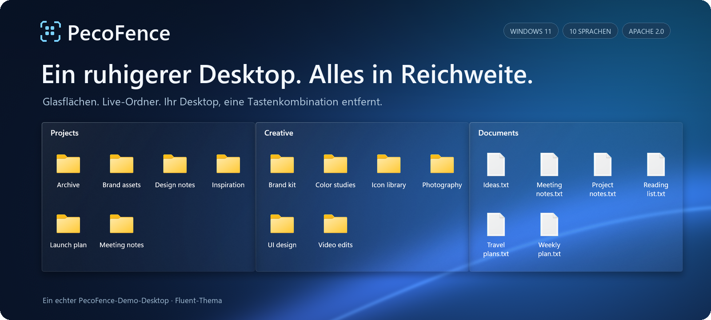

https://github.com/user-attachments/assets/c827f059-cfd7-4f6a-bed3-8b00411a7220

<p align="center">
  <strong>Eine kostenlose Open-Source-Alternative zu Stardock Fences für Windows 11.</strong><br>
  Sammle Dateien in Glas-Panels, wechsle Projekte per Tab und lass deinen KI-Agenten Layout, Aussehen und Sortierregeln über die integrierte CLI einstellen.
</p>

<p align="center">
  <a href="https://pecofence.jiang.jp/de/"><strong>Website</strong></a>
  &nbsp;·&nbsp; <a href="#pecofence-herunterladen"><strong>PecoFence herunterladen →</strong></a>
  &nbsp;·&nbsp; <a href="#dein-desktop-von-deiner-ki-eingerichtet"><strong>KI + CLI</strong></a>
  &nbsp;·&nbsp; <a href="#pecofence-in-aktion">In Aktion sehen</a>
  &nbsp;·&nbsp; <a href="../README.md">Dokumentation</a>
</p>

<p align="center">
  <a href="../../README.md">English</a>
  &nbsp;·&nbsp; <a href="README.zh-CN.md">简体中文</a>
  &nbsp;·&nbsp; <a href="README.zh-TW.md">繁體中文</a>
  &nbsp;·&nbsp; <a href="README.ja.md">日本語</a>
  &nbsp;·&nbsp; <a href="README.ko.md">한국어</a>
  &nbsp;·&nbsp; <strong>Deutsch</strong>
  &nbsp;·&nbsp; <a href="README.fr.md">Français</a>
  &nbsp;·&nbsp; <a href="README.es.md">Español</a>
  &nbsp;·&nbsp; <a href="README.pt-BR.md">Português (Brasil)</a>
  &nbsp;·&nbsp; <a href="README.ru.md">Русский</a>
</p>

---

<a id="lassen-sie-ihre-ki-aufräumen"></a>

## Dein Desktop. Von deiner KI eingerichtet

**CLI inklusive. Bereit für deinen KI-Agenten.**

Sag deinem KI-Agenten, wie du deinen Desktop nutzen möchtest. Mit der mitgelieferten `pecofence-cli` können Claude Code, Codex und Cursor deine aktuelle Konfiguration lesen und Änderungen direkt in PecoFence anwenden.

- **Mit eigenen Worten konfigurieren.** Ändere Design, Transparenz, Symbolgröße und globale Einstellungen oder passe alle Bereiche auf einmal an.
- **Einmal sortieren, dauerhaft Ordnung halten.** Erstelle Projektbereiche, ordne Symbole zu und lege Regeln an, die neue Dateien automatisch einsortieren.
- **Deine Einrichtung bewahren.** Momentaufnahmen speichern Bereichslayouts; der Konfigurationsexport und -import sichert Einstellungen, Regeln und Layouts und stellt sie wieder her.

**Mit deinem KI-Agenten ausprobieren**

Starte PecoFence und füge diese Anfrage in deinen KI-Coding-Agenten ein:

> Konfiguriere meinen Desktop mit pecofence-cli. Lies zuerst pecofence-cli skill und pecofence-cli describe und prüfe dann meine aktuellen Einstellungen und Bereiche. Sichere die Konfiguration vor Änderungen. Aktiviere den dunklen Modus und mache alle Bereiche transparenter.

Die CLI ist enthalten. Die Microsoft-Store-Version fügt `pecofence-cli` zum PATH hinzu. Beim portablen ZIP gib deinem Agenten den vollständigen Pfad zu `pecofence-cli.exe`.

<details>
<summary><strong>Beispielgespräch mit einem Coding-Agenten</strong></summary>

> Sammle die PDFs auf meinem Desktop in einem Docs-Bereich und sortiere neue PDFs automatisch dort ein. Aktiviere den dunklen Modus und mache die Bereiche transparenter.

```powershell
pecofence-cli config export "$env:USERPROFILE\pecofence-before-ai.json"
pecofence-cli snapshot save before-cleanup
pecofence-cli fence create --title Docs
pecofence-cli rule add --name PDFs --ext pdf --to Docs --index 0
pecofence-cli rule apply
pecofence-cli settings set theme dark
pecofence-cli fence set --all opacity clear
```

</details>

Für Agenten und Skripte: `describe` liefert den Befehlskatalog und JSON-Schemas, `skill` den Agenten-Leitfaden. JSON-Ergebnisse zeigen die Änderungen; strukturierte Anwendungsfehler helfen dem Agenten, den nächsten Schritt zu wählen.

[Erste Schritte mit der CLI →](../CLI.md#start-with-your-ai-agent)

## Alles bekommt seinen Platz

<p align="center">
  
</p>

## PecoFence in Aktion

### Ein Bereich. Viele Projekte.

Halte zusammengehörige Bereiche als Tabs beisammen. Wechsle mit einem Klick
von Project zu Ideas und zieh einen Tab heraus, wenn du mehr Platz brauchst.


### Dein Desktop – nur eine Tastenkombination entfernt.

Drücke **Strg + Alt + Leertaste**, um deine Bereiche vor die aktuelle Anwendung zu holen.
Hol dir, was du brauchst, und kehre mit **Esc** zurück.


<sub>Animationen aus dem <a href="https://pecofence.jiang.jp/de/manual/">Handbuch</a>. Die GIFs laufen in Endlosschleife.</sub>

## Kleine Details, die den Alltag leichter machen

| Erlebnis | Was dahintersteckt |
| :--- | :--- |
| **KI + CLI** | `pecofence-cli` – **Mit eigenen Worten konfigurieren.** Ändere Design, Transparenz, Symbolgröße und globale Einstellungen oder passe alle Bereiche auf einmal an. |
| **Weniger sortieren** | Regeln nach Dateityp, Endung, Name, Platzhalter, Verknüpfungsziel, Zeit und Größe. Neue Dateien finden ihren Bereich von selbst. |
| **Glas, das zu deinem Desktop passt** | Die Designs Fluent und Liquid Glass, heller und dunkler Modus, Farbton, Deckkraft und Symbolfärbung je Bereich. |
| **Vertraute Dateiverwaltung** | Explorer-Kontextmenüs, Drag & Drop, Kopieren/Einfügen, Mehrfachauswahl, Miniaturansichten sowie Symbol-, Listen- und Detailansicht. |
| **Ordner in Reichweite** | Hol dir einen Live-Ordner auf den Desktop. Stöbere in Unterordnern und sieh Änderungen sofort. |
| **Platz, wenn du ihn brauchst** | Klappe einen Bereich bis auf den Titel ein. Zum Ausklappen einfach mit der Maus darauf zeigen. Sperre ein Layout, das dir gefällt. Ein Doppelklick auf den Desktop blendet alle Bereiche aus. Ein zweiter holt sie zurück. |
| **Ein Weg zurück** | Layout-Momentaufnahmen, tägliche Sicherungen, Import/Export der Konfiguration und Tausch zwischen Bildschirmen. |
| **Ein kleiner Fußabdruck** | Eine native Rust-Anwendung, die im Leerlauf etwa 40 MB Arbeitsspeicher belegt (laut Task-Manager). Das Einstellungsfenster (WebView2) wird erst bei Bedarf geladen. |

Automatische Sortierregeln lassen Dateien an ihrem ursprünglichen Speicherort. Verschiebungen,
die du selbst anstößt, funktionieren wie im Explorer.

[Die vollständige Funktionsliste →](../FEATURES.md)

## PecoFence herunterladen

<a href="https://apps.microsoft.com/detail/9MV6WG3XNWSX?mode=direct"></a>

Die Microsoft-Store-Version ist von Microsoft signiert, aktualisiert sich automatisch und zeigt keine SmartScreen-Abfrage. Dieselbe App gibt es auch als:

- **Portables ZIP**: Lade `pecofence-v<Version>-x64-portable.zip` von der **Releases**-Seite dieses Repositorys herunter, entpacke die **gesamte ZIP-Datei** in einen Ordner und starte `pecofence.exe`.
- **Installer**: `pecofence-v<Version>-x64-setup.exe` auf derselben Seite installiert PecoFence für dein Windows-Konto, mit Startmenü-Eintrag und Deinstallationsprogramm.
- **winget**: `winget install DayuanJiang.PecoFence` installiert den portablen Build und überspringt die SmartScreen-Abfrage.

<details>
<summary><strong>Systemvoraussetzungen, Konfiguration und ein paar nützliche Hinweise</strong></summary>

- Windows 11 22H2 oder neuer. Für die Einstellungen wird die Microsoft Edge WebView2 Runtime benötigt.
- Beim ersten Start werden die Bereiche „Programme“, „Ordner“, „Dateien und Dokumente“ und „Desktop“ in der gewählten Sprache angelegt. Beim Beenden erscheinen die Windows-Desktopsymbole wieder.
- Die Konfiguration liegt in `%APPDATA%\PecoFence\config.json`. Mit `--portable` gestartet, bleibt sie in einem Ordner `config` neben der ausführbaren Datei.
- ZIP und Installer sind nicht signiert. Fragt Windows SmartScreen beim ersten Start nach, wähle **Weitere Informationen → Trotzdem ausführen**.

[Anleitung zur portablen Version](../PORTABLE.md) · [Sprachen und Übersetzungen](../LOCALIZATION.md) · [Windows-Installationsanleitung](../INSTALLER.md)

</details>

## Selbst bauen. Selbst gestalten.

PecoFence steht unter der Apache-2.0-Lizenz, und Beiträge sind willkommen – von einer treffenderen
Übersetzung bis zu einer besseren Desktop-Interaktion.

[Mitwirken](../../CONTRIBUTING.md) · [Übersetzung verbessern](../LOCALIZATION.md) · [Entwicklerhandbuch](../DEVELOPMENT.md)

---

**Für einen Desktop, zu dem du gern zurückkehrst.**  
[Apache-2.0-Lizenz](../../LICENSE) · [Hinweise zu Drittanbietern](../../third_party/README.md)
