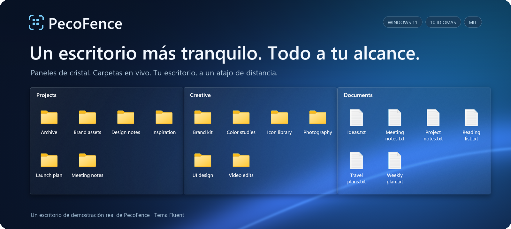
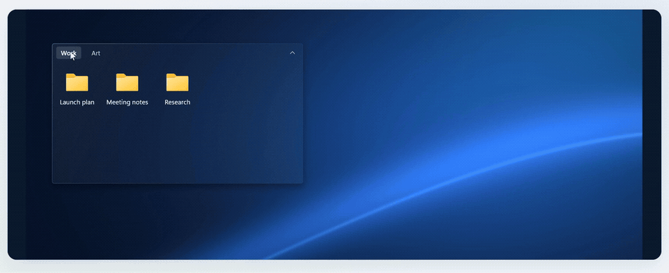
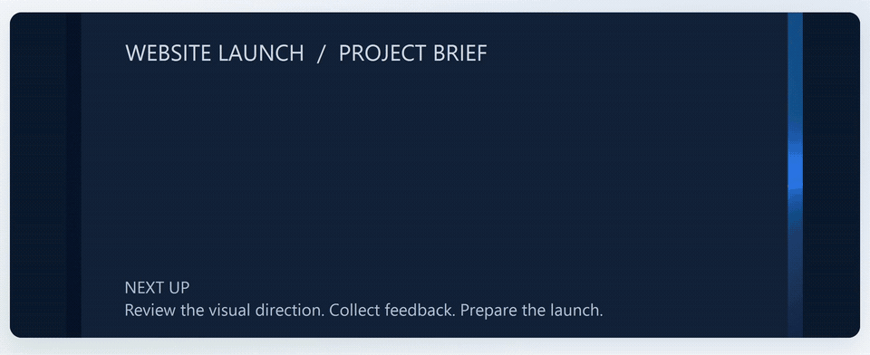

<p align="center">
  
</p>

<p align="center">
  <strong>Una alternativa gratuita y de código abierto a Stardock Fences para Windows 11.</strong><br>
  Organiza tus archivos en paneles de cristal. Tráelos delante de cualquier aplicación con un atajo.
</p>

<p align="center">
  <a href="#descarga-pecofence"><strong>Descarga PecoFence →</strong></a>
  &nbsp;·&nbsp; <a href="#míralo-en-acción">Míralo en acción</a>
  &nbsp;·&nbsp; <a href="../README.md">Documentación</a>
</p>

<p align="center">
  <a href="../../README.md">English</a>
  &nbsp;·&nbsp; <a href="README.zh-CN.md">简体中文</a>
  &nbsp;·&nbsp; <a href="README.zh-TW.md">繁體中文</a>
  &nbsp;·&nbsp; <a href="README.ja.md">日本語</a>
  &nbsp;·&nbsp; <a href="README.ko.md">한국어</a>
  &nbsp;·&nbsp; <a href="README.de.md">Deutsch</a>
  &nbsp;·&nbsp; <a href="README.fr.md">Français</a>
  &nbsp;·&nbsp; <strong>Español</strong>
  &nbsp;·&nbsp; <a href="README.pt-BR.md">Português (Brasil)</a>
  &nbsp;·&nbsp; <a href="README.ru.md">Русский</a>
</p>

---

## Dale un lugar a cada cosa

Proyectos, capturas de pantalla, cosas para leer más tarde: guárdalas en sus propios grupos,
ordenadas como tú trabajas. PecoFence añade la estructura justa para que tu escritorio vuelva
a ser útil.

| **Agrupa tu trabajo** | **Ten tus carpetas a mano** | **Despeja el espacio** |
| :--- | :--- | :--- |
| Crea un grupo para cada proyecto. Arrástralo, cambia su tamaño y ajústalo en su sitio. | Coloca una carpeta en vivo sobre el escritorio. Navega por sus subcarpetas y ve los cambios al momento. | Haz doble clic en el escritorio para ocultar los grupos. Vuelve a hacer doble clic para recuperarlos. |

## Míralo en acción

### Una ventana. Varios espacios de trabajo.

Mantén juntos los grupos relacionados como pestañas. Pasa de Work a Art con un clic y,
cuando necesites más sitio, arrastra una pestaña fuera para convertirla en su propio grupo.



### Tu escritorio, a un atajo de distancia.

Pulsa **Ctrl + Alt + Espacio** para traer tus grupos por encima de la aplicación actual.
Toma lo que necesites y pulsa **Esc** para volver.



<sub>Grabado en PecoFence con archivos de demostración y el tema Fluent. Los GIF se repiten automáticamente.</sub>

## Pequeños detalles, mejor día a día

| Experiencia | Qué obtienes |
| :--- | :--- |
| **Menos ordenar** | Reglas por tipo de archivo, extensión, nombre, comodines, destino del acceso directo, hora y tamaño. Los archivos nuevos encuentran su grupo solos. |
| **Cristal a la medida de tu escritorio** | Temas Fluent y Liquid Glass, modos claro y oscuro, colores por grupo, opacidad y tinte de iconos. |
| **Archivos como siempre** | Menús contextuales del Explorador, arrastrar y soltar, copiar y pegar, selección múltiple, miniaturas y vistas de iconos, lista y detalles. |
| **Espacio cuando lo necesitas** | Contrae un grupo hasta su título. Pasa el cursor para expandirlo. Bloquea la distribución que te gusta. |
| **Un camino de vuelta** | Instantáneas de distribución, copias de seguridad diarias, importación y exportación de la configuración e intercambio entre pantallas. |
| **Huella mínima** | Una aplicación nativa escrita en Rust; el panel de Configuración en WebView2 se carga solo cuando hace falta. |

Las reglas de organización automática dejan los archivos en su ubicación original. Los movimientos
que inicias tú funcionan igual que en el Explorador.

[Explora la lista completa de funciones →](../FEATURES.md)

## Habla tu idioma

**Español · English · 简体中文 · 繁體中文 · 日本語**  
**한국어 · Deutsch · Français · Português (Brasil) · Русский**

Cámbialo al instante en **Configuración → General → Idioma de la interfaz** o deja que siga a Windows.
Todas las traducciones vienen incluidas y funcionan sin conexión. Tus nombres de archivo y los
nombres que pongas tú se conservan.

## Descarga PecoFence

1. Abre la página de **Releases** de este repositorio y descarga `pecofence-<versión>-x64.zip`.
2. Extrae el **ZIP completo** en una carpeta y ejecuta `pecofence.exe`.
3. Empieza a organizar. Haz clic derecho en el icono de la bandeja cuando necesites la Configuración
   o quieras salir.

**Windows 11 x64 · ZIP portátil · Sin cuenta · Licencia MIT**

El primer inicio crea los grupos Programas, Carpetas, Archivos y documentos y Escritorio
en el idioma que elijas. Los iconos del escritorio de Windows se restauran al salir.

<details>
<summary><strong>Requisitos, configuración y algunas notas útiles</strong></summary>

- Diseñado para Windows 11 22H2 y posteriores. La mayor parte de las pruebas nativas se ha hecho
  en 25H2; la matriz completa de versiones anteriores y hardware multipantalla sigue en curso.
- La Configuración necesita Microsoft Edge WebView2 Runtime. Mantén `WebView2Loader.dll` y
  `pecofence-watchdog.exe`, incluidos en el ZIP, junto a la aplicación.
- La configuración se guarda en `%APPDATA%\PecoFence\config.json`. Inicia con `--portable`
  para guardarla en una carpeta `config` junto al ejecutable.
- Las instalaciones existentes conservan su directorio de configuración anterior.
  Consulta la [guía de actualización](../UPGRADING.md).
- El cristal usa el fondo de pantalla estático. No refracta otras aplicaciones ni fondos
  de vídeo en directo.
- Los cuadros de diálogo propios de Windows y las entradas de terceros en el menú del Explorador
  siguen el idioma de Windows.
- Las compilaciones portátiles actuales no están firmadas.

[Guía de la edición portátil](../PORTABLE.md) · [Guía de idiomas](../LOCALIZATION.md)

</details>

## Constrúyelo. Hazlo tuyo.

PecoFence tiene licencia MIT y las contribuciones son bienvenidas: desde una traducción más
precisa hasta una interacción de escritorio mejor resuelta.

[Contribuir](../../CONTRIBUTING.md) · [Mejorar una traducción](../LOCALIZATION.md) · [Guía de desarrollo](../DEVELOPMENT.md)

<details>
<summary><strong>Compilar desde el código fuente</strong></summary>

Instala Rust stable y Visual Studio Build Tools con la carga de trabajo de C++ y el Windows SDK.

```powershell
cargo build --locked --release
Copy-Item third_party/webview2/WebView2Loader.x64.dll target/release/WebView2Loader.dll
```

Crea un ZIP portátil listo para distribuir:

```powershell
./scripts/make-portable.ps1
```

El espacio de trabajo se organiza en `crates/` para la aplicación nativa, `ui/` para la
Configuración, `locales/` para las traducciones y `scripts/` para verificación y empaquetado.
El proyecto de vídeo opcional en `extras/` es independiente de la compilación de la aplicación.

[Instrucciones de publicación](../RELEASING.md) · [Estructura del código](../DEVELOPMENT.md#architecture)

</details>

---

**Hecho para un escritorio al que da gusto volver.**  
[Licencia MIT](../../LICENSE) · [Avisos de terceros](../../third_party/README.md)
