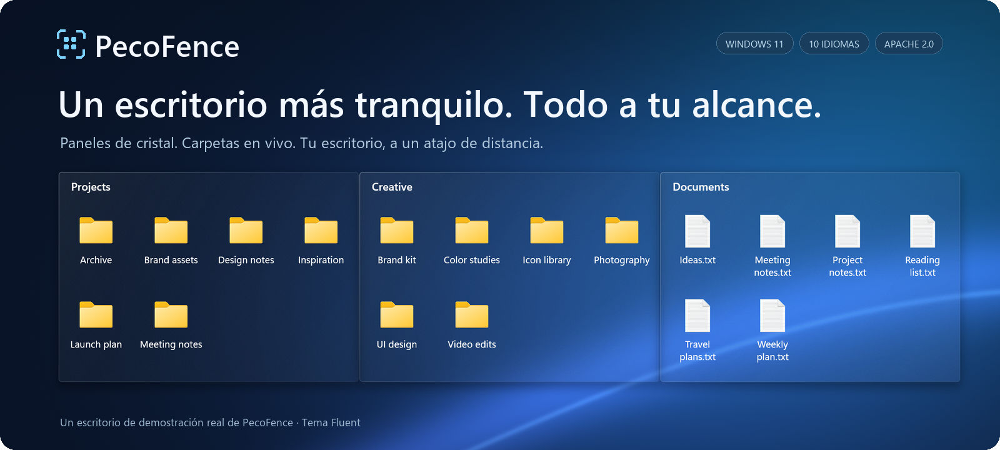

https://github.com/user-attachments/assets/c827f059-cfd7-4f6a-bed3-8b00411a7220

<p align="center">
  <strong>Una alternativa gratuita y de código abierto a Stardock Fences para Windows 11.</strong><br>
  Agrupa archivos en paneles de cristal, cambia de proyecto con pestañas y deja que tu agente de IA configure la distribución, la apariencia y las reglas de organización con la CLI integrada.
</p>

<p align="center">
  <a href="https://pecofence.jiang.jp/es/"><strong>Sitio web</strong></a>
  &nbsp;·&nbsp; <a href="#descarga-pecofence"><strong>Descarga PecoFence →</strong></a>
  &nbsp;·&nbsp; <a href="#tu-escritorio-configurado-por-tu-ia"><strong>IA + CLI</strong></a>
  &nbsp;·&nbsp; <a href="#míralo-en-acción">Míralo en acción</a>
  &nbsp;·&nbsp; <a href="../README.md">Documentación</a>
</p>

<p align="center">
  <a href="../../README.md">English</a>
  &nbsp;·&nbsp; <a href="README.zh-CN.md">简体中文</a>
  &nbsp;·&nbsp; <a href="README.zh-TW.md">繁體中文</a>
  &nbsp;·&nbsp; <a href="README.ja.md">日本語</a>
  &nbsp;·&nbsp; <a href="README.ko.md">한국어</a>
  &nbsp;·&nbsp; <a href="README.de.md">Deutsch</a>
  &nbsp;·&nbsp; <a href="README.fr.md">Français</a>
  &nbsp;·&nbsp; <strong>Español</strong>
  &nbsp;·&nbsp; <a href="README.pt-BR.md">Português (Brasil)</a>
  &nbsp;·&nbsp; <a href="README.ru.md">Русский</a>
</p>

---

<a id="pídele-a-tu-ia-que-lo-organice"></a>

## Tu escritorio, configurado por tu IA

**CLI incluida. Lista para tu agente de IA.**

Dile a tu agente de IA cómo quieres usar tu escritorio. Con `pecofence-cli`, incluida en la aplicación, Claude Code, Codex y Cursor pueden leer tu configuración actual y aplicar cambios directamente en PecoFence.

- **Configura con tus propias palabras.** Cambia temas, transparencia, tamaño de los iconos y ajustes globales, o modifica todos los grupos a la vez.
- **Organiza una vez y mantén el orden.** Crea grupos por proyecto, distribuye los iconos y agrega reglas que clasifiquen los archivos nuevos automáticamente.
- **Guarda tu configuración favorita.** Usa instantáneas para la distribución de los grupos y la exportación e importación de configuración para ajustes, reglas y distribuciones.

**Pruébalo con tu agente de IA**

Abre PecoFence y pega esta petición en tu agente de programación con IA:

> Configura mi escritorio con pecofence-cli. Primero lee la salida de pecofence-cli skill y pecofence-cli describe; luego revisa mis ajustes y grupos actuales. Haz una copia de mi configuración antes de cambiarla. Activa el modo oscuro y haz todos los grupos más transparentes.

La CLI está incluida. La edición de Microsoft Store agrega `pecofence-cli` al PATH. Con el ZIP portátil, indica a tu agente la ruta completa de `pecofence-cli.exe`.

<details>
<summary><strong>Conversación de ejemplo con un agente de programación</strong></summary>

> Pon los PDF de mi escritorio en un grupo Docs y clasifica allí también los PDF nuevos. Activa el modo oscuro y haz los grupos más transparentes.

```powershell
pecofence-cli config export "$env:USERPROFILE\pecofence-before-ai.json"
pecofence-cli snapshot save before-cleanup
pecofence-cli fence create --title Docs
pecofence-cli rule add --name PDFs --ext pdf --to Docs --index 0
pecofence-cli rule apply
pecofence-cli settings set theme dark
pecofence-cli fence set --all opacity clear
```

</details>

Para agentes y scripts: `describe` ofrece el catálogo de comandos y los esquemas JSON; `skill`, la guía del agente. Los resultados JSON indican qué cambió y los errores estructurados de la aplicación ayudan al agente a elegir el siguiente paso.

[Primeros pasos con la CLI →](../CLI.md#start-with-your-ai-agent)

## Dale un lugar a cada cosa

Proyectos, capturas de pantalla, cosas para leer más tarde: guárdalo todo en sus propios grupos,
organizado a tu manera. PecoFence aporta la estructura justa para que tu escritorio vuelva
a ser útil.

<p align="center">
  
</p>

| **Agrupa tu trabajo** | **Ten tus carpetas a mano** | **Despeja el espacio** |
| :--- | :--- | :--- |
| Crea un grupo para cada proyecto. Arrástralo, cambia su tamaño y ajústalo en su sitio. | Coloca una carpeta en vivo sobre el escritorio. Navega por sus subcarpetas y ve los cambios al momento. | Haz doble clic en el escritorio para ocultar los grupos. Vuelve a hacer doble clic para recuperarlos. |

## Míralo en acción

### Una ventana. Varios espacios de trabajo.

Mantén juntos los grupos relacionados como pestañas. Pasa de Project a Ideas con un clic y,
cuando necesites más espacio, arrastra una pestaña fuera para convertirla en su propio grupo.


### Tu escritorio, a un atajo de distancia.

Presiona **Ctrl + Alt + Espacio** y la vista rápida trae tus grupos por encima de la aplicación actual.
Toma lo que necesites y presiona **Esc** para volver.


<sub>Animaciones del <a href="https://pecofence.jiang.jp/es/manual/">manual</a>. Los GIF se repiten automáticamente.</sub>

## Pequeños detalles que mejoran el día a día

| Experiencia | Qué obtienes |
| :--- | :--- |
| **IA + CLI** | `pecofence-cli` — **Configura con tus propias palabras.** Cambia temas, transparencia, tamaño de los iconos y ajustes globales, o modifica todos los grupos a la vez. |
| **Menos tiempo ordenando** | Reglas por tipo de archivo, extensión, nombre, comodines, destino del acceso directo, hora y tamaño. Los archivos nuevos encuentran su grupo solos. |
| **Cristal a la medida de tu escritorio** | Temas Fluent y Liquid Glass, modos claro y oscuro, colores por grupo, opacidad y tinte de iconos. |
| **Archivos como siempre** | Menús contextuales del Explorador de archivos, arrastrar y soltar, copiar y pegar, selección múltiple, miniaturas y vistas de iconos, lista y detalles. |
| **Espacio cuando lo necesitas** | Contrae un grupo hasta su título. Pasa el cursor para expandirlo. Bloquea la distribución que te gusta. |
| **Siempre puedes volver atrás** | Instantáneas de distribución, copias de seguridad diarias, importación y exportación de la configuración e intercambio entre pantallas. |
| **Huella mínima** | Una aplicación nativa escrita en Rust que en reposo ocupa unos 40 MB de memoria (según el Administrador de tareas). El panel de Configuración en WebView2 se carga solo cuando hace falta. |

Las reglas de organización automática dejan los archivos en su ubicación original. Los movimientos
que inicias tú funcionan igual que en el Explorador de archivos.

[Explora la lista completa de funciones →](../FEATURES.md)

## Descarga PecoFence

<a href="https://apps.microsoft.com/detail/9MV6WG3XNWSX?mode=direct"></a>

La versión de Microsoft Store está firmada por Microsoft, se actualiza sola y nunca muestra el aviso de SmartScreen. ¿Prefieres un ZIP? La versión portátil de abajo es la misma aplicación.

1. Abre la página de **Releases** de este repositorio y descarga `pecofence-v<versión>-x64-portable.zip`.
2. Extrae el **ZIP completo** en una carpeta y ejecuta `pecofence.exe`.
3. Empieza a organizar. Haz clic con el botón derecho en el icono de la bandeja cuando necesites
   la Configuración o quieras salir.

¿Prefieres un instalador? `pecofence-v<versión>-x64-setup.exe`, en la misma página, instala PecoFence para tu usuario de Windows, con acceso en el menú Inicio y desinstalador. Usa la misma configuración que el ZIP.

¿Prefieres un gestor de paquetes? `winget install DayuanJiang.PecoFence` instala la misma versión portátil y evita el aviso de SmartScreen.

**Windows 11 x64 · Unos 40 MB de memoria · ZIP portátil · Sin cuenta · Licencia Apache 2.0**

El primer inicio crea los grupos «Programas», «Carpetas», «Archivos y documentos» y «Escritorio»
en el idioma que elijas. Los iconos del escritorio de Windows se restauran al salir.

<details>
<summary><strong>Requisitos, configuración y algunas notas útiles</strong></summary>

- Diseñado para Windows 11 22H2 y posteriores. La mayoría de las pruebas se hicieron en 25H2;
  todavía faltan pruebas completas en versiones anteriores y con varias pantallas.
- La Configuración necesita Microsoft Edge WebView2 Runtime. Mantén `WebView2Loader.dll` y
  `pecofence-watchdog.exe`, incluidos en el ZIP, junto a la aplicación.
- La configuración se guarda en `%APPDATA%\PecoFence\config.json`. Ejecuta la aplicación con
  `--portable` para guardarla en una carpeta `config` junto al ejecutable.
- Las instalaciones existentes conservan su directorio de configuración anterior.
  Consulta la [guía de actualización](../UPGRADING.md).
- El cristal usa el fondo de pantalla estático. No refracta otras aplicaciones ni fondos
  de pantalla animados.
- Los cuadros de diálogo propios de Windows y las entradas de terceros en el menú del Explorador de archivos
  siguen el idioma de Windows.
- Las versiones portátiles no están firmadas. Si Windows SmartScreen aparece en el primer inicio, elige
  **Más información → Ejecutar de todas formas**. Instalar desde Microsoft Store o con winget evita el aviso.

[Guía de la edición portátil](../PORTABLE.md) · [Guía de idiomas](../LOCALIZATION.md) · [Guía del instalador de Windows](../INSTALLER.md)

</details>

## Constrúyelo. Hazlo tuyo.

PecoFence tiene licencia Apache 2.0 y las contribuciones son bienvenidas: desde una traducción más
precisa hasta una interacción de escritorio mejor resuelta.

[Contribuir](../../CONTRIBUTING.md) · [Mejorar una traducción](../LOCALIZATION.md) · [Guía de desarrollo](../DEVELOPMENT.md)

<details>
<summary><strong>Compilar desde el código fuente</strong></summary>

Instala Rust stable y Visual Studio Build Tools con la carga de trabajo de C++ y el Windows SDK.

```powershell
cargo build --locked --release
Copy-Item third_party/webview2/WebView2Loader.x64.dll target/release/WebView2Loader.dll
```

Crea un ZIP portátil listo para distribuir:

```powershell
./scripts/make-portable.ps1
```

El espacio de trabajo se organiza en `crates/` para la aplicación nativa, `ui/` para la
Configuración, `locales/` para las traducciones y `scripts/` para verificación y empaquetado.
El sitio web del producto está en `site/`, y el proyecto de vídeo opcional en `extras/`
es independiente de la compilación de la aplicación.

[Instrucciones de publicación](../RELEASING.md) · [Estructura del código](../DEVELOPMENT.md#architecture)

</details>

---

**Hecho para un escritorio al que da gusto volver.**  
[Licencia Apache 2.0](../../LICENSE) · [Avisos de terceros](../../third_party/README.md)
