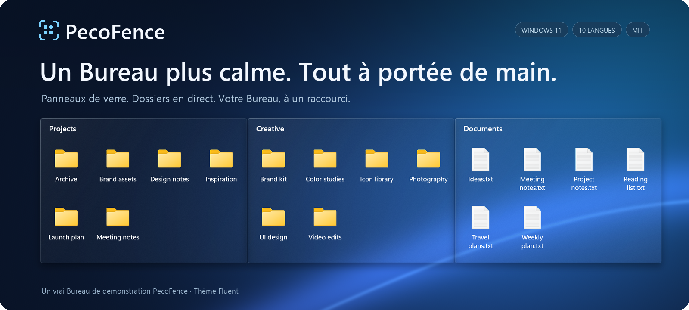

<p align="center">
  
</p>

https://github.com/user-attachments/assets/6320cf28-a791-4720-9659-b4575df021a0

<p align="center">
  <strong>Une alternative libre et gratuite à Stardock Fences pour Windows 11.</strong><br>
  Rangez vos fichiers dans des panneaux de verre. Faites-les apparaître au-dessus de n’importe quelle application d’un seul raccourci.
</p>

<p align="center">
  <a href="#télécharger-pecofence"><strong>Télécharger PecoFence →</strong></a>
  &nbsp;·&nbsp; <a href="#voyez-le-en-action">Voyez-le en action</a>
  &nbsp;·&nbsp; <a href="../README.md">Documentation</a>
</p>

<p align="center">
  <a href="../../README.md">English</a>
  &nbsp;·&nbsp; <a href="README.zh-CN.md">简体中文</a>
  &nbsp;·&nbsp; <a href="README.zh-TW.md">繁體中文</a>
  &nbsp;·&nbsp; <a href="README.ja.md">日本語</a>
  &nbsp;·&nbsp; <a href="README.ko.md">한국어</a>
  &nbsp;·&nbsp; <a href="README.de.md">Deutsch</a>
  &nbsp;·&nbsp; <strong>Français</strong>
  &nbsp;·&nbsp; <a href="README.es.md">Español</a>
  &nbsp;·&nbsp; <a href="README.pt-BR.md">Português (Brasil)</a>
  &nbsp;·&nbsp; <a href="README.ru.md">Русский</a>
</p>

---

## Une place pour chaque chose

Projets en cours, captures d’écran, lectures pour plus tard : donnez à chacun son groupe,
disposé comme vous travaillez. PecoFence ajoute juste ce qu’il faut de structure pour rendre
votre Bureau à nouveau utile.

| **Regroupez votre travail** | **Gardez vos dossiers à portée** | **Libérez de l’espace** |
| :--- | :--- | :--- |
| Créez un groupe par projet. Déplacez-le, redimensionnez-le et alignez-le d’un geste. | Posez un dossier en direct sur votre Bureau. Parcourez ses sous-dossiers et voyez les changements au moment où ils se produisent. | Double-cliquez sur le Bureau pour masquer vos groupes. Double-cliquez à nouveau pour les retrouver. |

## Voyez-le en action

### Une fenêtre. Plusieurs espaces de travail.

Rassemblez les groupes qui vont ensemble sous forme d’onglets. Passez de Work à Art en un clic,
puis détachez un onglet quand vous avez besoin de plus de place.


### Votre Bureau, toujours à un raccourci.

Appuyez sur **Ctrl + Alt + Espace** pour faire apparaître vos groupes au-dessus de l’application
en cours. Prenez ce qu’il vous faut, puis appuyez sur **Échap** pour y revenir.


<sub>Enregistré dans PecoFence avec des fichiers de démonstration et le thème Fluent. Les GIF bouclent automatiquement.</sub>

## Les petits détails qui changent le quotidien

| Expérience | Ce que vous y gagnez |
| :--- | :--- |
| **Moins de tri** | Des règles par type de fichier, extension, nom, motif, cible de raccourci, date et taille. Les nouveaux fichiers trouvent leur groupe tout seuls. |
| **Un verre assorti à votre fond d’écran** | Thèmes Fluent et Liquid Glass, modes clair et sombre, couleur, opacité et teinte des icônes réglables groupe par groupe. |
| **Des fichiers qui se manipulent comme d’habitude** | Menus contextuels de l’Explorateur, glisser-déposer, copier-coller, sélection multiple, miniatures et affichages Icônes, Liste ou Détails. |
| **De la place quand il en faut** | Repliez un groupe sur son titre. Survolez-le pour le développer. Verrouillez une disposition qui vous convient. |
| **Un retour toujours possible** | Instantanés de disposition, sauvegardes quotidiennes, import/export de la configuration et échange entre écrans. |
| **Une empreinte légère** | Une application native en Rust ; le panneau Paramètres en WebView2 se charge à la demande. |

Les règles de classement automatique laissent les fichiers à leur emplacement d’origine.
Les déplacements que vous lancez vous-même se comportent comme dans l’Explorateur.

[Découvrir la liste complète des fonctionnalités →](../FEATURES.md)

## PecoFence parle votre langue

**Français · English · 简体中文 · 繁體中文 · 日本語**  
**한국어 · Deutsch · Español · Português (Brasil) · Русский**

Changez de langue instantanément dans **Paramètres → Général → Langue d’affichage**, ou suivez Windows.
Toutes les traductions sont incluses et fonctionnent hors ligne. Vos noms de fichiers et vos noms
personnalisés restent intacts.

## Télécharger PecoFence

<a href="https://apps.microsoft.com/detail/9MV6WG3XNWSX?mode=direct"></a>

La version Microsoft Store est signée par Microsoft, se met à jour automatiquement et n’affiche jamais l’avertissement SmartScreen. Vous préférez un simple ZIP ? La version portable ci-dessous est la même application.

1. Ouvrez la page **Releases** de ce dépôt et téléchargez `pecofence-<version>-x64.zip`.
2. Extrayez **l’intégralité du ZIP** dans un dossier et lancez `pecofence.exe`.
3. Commencez à ranger. Un clic droit sur l’icône de la zone de notification ouvre les Paramètres
   ou quitte l’application.

Vous préférez un gestionnaire de paquets ? `winget install DayuanJiang.PecoFence` installe la même version portable et évite l’avertissement SmartScreen.

**Windows 11 x64 · ZIP portable · Sans compte · Licence Apache 2.0**

Au premier lancement, PecoFence crée les groupes Applications, Dossiers, Fichiers et documents
et Bureau dans la langue de votre choix. Les icônes du Bureau Windows réapparaissent quand vous quittez.

<details>
<summary><strong>Configuration requise, réglages et quelques remarques utiles</strong></summary>

- Conçu pour Windows 11 22H2 et versions ultérieures. La plupart des tests natifs ont été menés
  sur 25H2 ; la matrice complète des versions plus anciennes et des configurations multi-écrans
  est encore en cours.
- Microsoft Edge WebView2 Runtime est nécessaire pour les Paramètres. Conservez
  `WebView2Loader.dll` et `pecofence-watchdog.exe` fournis dans le ZIP à côté de l’application.
- La configuration est enregistrée dans `%APPDATA%\PecoFence\config.json`. Lancez l’application
  avec `--portable` pour la garder dans un dossier `config` à côté de l’exécutable.
- Les installations existantes conservent leur ancien dossier de configuration.
  Consultez le [guide de mise à niveau](../UPGRADING.md).
- Le verre s’appuie sur le fond d’écran statique. Il ne réfracte ni les autres applications
  ni les fonds d’écran vidéo.
- Les boîtes de dialogue de Windows et les entrées tierces des menus de l’Explorateur suivent
  la langue de Windows.
- Les versions portables ne sont pas signées. Si Windows SmartScreen s’affiche au premier lancement, choisissez
  **Informations complémentaires → Exécuter quand même**. L’installation via le Microsoft Store ou winget évite cet avertissement.

[Guide de l’édition portable](../PORTABLE.md) · [Guide des langues](../LOCALIZATION.md)

</details>

## Compilez-le. Faites-le vôtre.

PecoFence est sous licence Apache 2.0 et les contributions sont bienvenues, d’une traduction plus juste
à une interaction mieux pensée sur le Bureau.

[Contribuer](../../CONTRIBUTING.md) · [Améliorer une traduction](../LOCALIZATION.md) · [Guide de développement](../DEVELOPMENT.md)

<details>
<summary><strong>Compiler depuis les sources</strong></summary>

Installez Rust stable ainsi que Visual Studio Build Tools avec la charge de travail C++ et le SDK Windows.

```powershell
cargo build --locked --release
Copy-Item third_party/webview2/WebView2Loader.x64.dll target/release/WebView2Loader.dll
```

Créez un ZIP portable prêt à distribuer :

```powershell
./scripts/make-portable.ps1
```

L’espace de travail se compose de `crates/` pour l’application native, `ui/` pour les Paramètres,
`locales/` pour les traductions et `scripts/` pour la vérification et l’empaquetage.
Le projet vidéo facultatif dans `extras/` est indépendant de la compilation de l’application.

[Instructions de publication](../RELEASING.md) · [Organisation des sources](../DEVELOPMENT.md#architecture)

</details>

---

**Conçu pour un Bureau où l’on a plaisir à revenir.**  
[Licence Apache 2.0](../../LICENSE) · [Mentions tierces](../../third_party/README.md)
