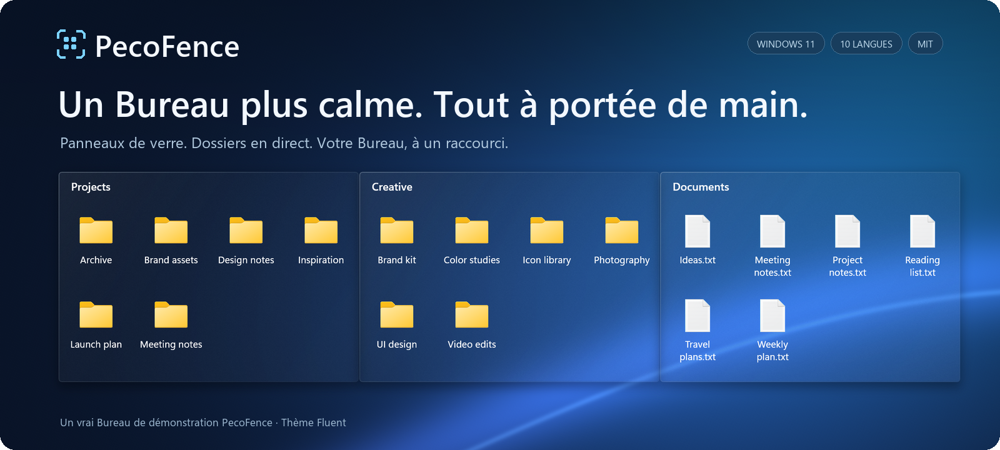

https://github.com/user-attachments/assets/c827f059-cfd7-4f6a-bed3-8b00411a7220

<p align="center">
  <strong>Une alternative libre et gratuite à Stardock Fences pour Windows 11.</strong><br>
  Regroupez vos fichiers dans des panneaux de verre, passez d’un projet à l’autre par onglets et confiez la disposition, l’apparence et les règles de tri à votre agent IA grâce à la CLI intégrée.
</p>

<p align="center">
  <a href="https://pecofence.jiang.jp/fr/"><strong>Site web</strong></a>
  &nbsp;·&nbsp; <a href="#télécharger-pecofence"><strong>Télécharger PecoFence →</strong></a>
  &nbsp;·&nbsp; <a href="#votre-bureau-configuré-par-votre-ia"><strong>IA + CLI</strong></a>
  &nbsp;·&nbsp; <a href="#voyez-le-en-action">Voyez-le en action</a>
  &nbsp;·&nbsp; <a href="../README.md">Documentation</a>
</p>

<p align="center">
  <a href="../../README.md">English</a>
  &nbsp;·&nbsp; <a href="README.zh-CN.md">简体中文</a>
  &nbsp;·&nbsp; <a href="README.zh-TW.md">繁體中文</a>
  &nbsp;·&nbsp; <a href="README.ja.md">日本語</a>
  &nbsp;·&nbsp; <a href="README.ko.md">한국어</a>
  &nbsp;·&nbsp; <a href="README.de.md">Deutsch</a>
  &nbsp;·&nbsp; <strong>Français</strong>
  &nbsp;·&nbsp; <a href="README.es.md">Español</a>
  &nbsp;·&nbsp; <a href="README.pt-BR.md">Português (Brasil)</a>
  &nbsp;·&nbsp; <a href="README.ru.md">Русский</a>
</p>

---

<a id="demandez-à-votre-ia-de-ranger"></a>

## Votre Bureau, configuré par votre IA

**CLI incluse. Prête pour votre agent IA.**

Dites à votre agent IA comment vous souhaitez organiser votre Bureau. Avec `pecofence-cli`, incluse dans l’application, Claude Code, Codex et Cursor peuvent lire votre configuration et appliquer les changements directement dans PecoFence.

- **Configurez avec vos propres mots.** Modifiez le thème, la transparence, la taille des icônes et les paramètres généraux, ou ajustez tous les groupes à la fois.
- **Rangez une fois, gardez l’ordre.** Créez des groupes par projet, répartissez les icônes et ajoutez des règles pour trier automatiquement les nouveaux fichiers.
- **Conservez vos réglages préférés.** Les instantanés enregistrent la disposition des groupes ; l’export et l’import de configuration sauvegardent et restaurent paramètres, règles et dispositions.

**Essayez avec votre agent IA**

Ouvrez PecoFence, puis collez cette demande dans votre agent de codage IA :

> Configure mon bureau avec pecofence-cli. Lis d’abord pecofence-cli skill et pecofence-cli describe, puis examine mes paramètres et groupes actuels. Sauvegarde ma configuration avant toute modification. Passe en mode sombre et rends tous les groupes plus transparents.

La CLI est incluse. L’édition Microsoft Store ajoute `pecofence-cli` au PATH. Avec le ZIP portable, indiquez à votre agent le chemin complet de `pecofence-cli.exe`.

<details>
<summary><strong>Exemple de conversation avec un agent de codage IA</strong></summary>

> Regroupe les PDF de mon bureau dans Docs et classe aussi les prochains PDF dans ce groupe. Passe en mode sombre et rends les groupes plus transparents.

```powershell
pecofence-cli config export "$env:USERPROFILE\pecofence-before-ai.json"
pecofence-cli snapshot save before-cleanup
pecofence-cli fence create --title Docs
pecofence-cli rule add --name PDFs --ext pdf --to Docs --index 0
pecofence-cli rule apply
pecofence-cli settings set theme dark
pecofence-cli fence set --all opacity clear
```

</details>

Pour les agents et les scripts : `describe` fournit le catalogue de commandes et les schémas JSON ; `skill`, le guide de l’agent. Les résultats JSON indiquent ce qui a changé, et les erreurs structurées de l’application aident l’agent à choisir la suite.

[Premiers pas avec la CLI →](../CLI.md#start-with-your-ai-agent)

## Une place pour chaque chose

<p align="center">
  
</p>

## Voyez-le en action

### Une fenêtre. Plusieurs espaces de travail.

Rassemblez les groupes qui vont ensemble sous forme d’onglets. Passez de Project à Ideas en un clic,
puis détachez un onglet quand vous avez besoin de plus de place.


### Votre Bureau à portée de raccourci.

Avec l’aperçu des groupes, **Ctrl + Alt + Espace** affiche vos groupes au-dessus de l’application
en cours. Prenez ce qu’il vous faut, puis appuyez sur **Échap** pour y revenir.


<sub>Animations tirées du <a href="https://pecofence.jiang.jp/fr/manual/">manuel</a>. Les GIF bouclent automatiquement.</sub>

## Les petits détails qui changent le quotidien

| Fonction | Ce que vous y gagnez |
| :--- | :--- |
| **IA + CLI** | `pecofence-cli` — **Configurez avec vos propres mots.** Modifiez le thème, la transparence, la taille des icônes et les paramètres généraux, ou ajustez tous les groupes à la fois. |
| **Moins de tri** | Des règles par type de fichier, extension, nom, motif, cible de raccourci, date et taille. Les nouveaux fichiers trouvent leur groupe tout seuls. |
| **Un verre assorti à votre fond d’écran** | Thèmes Fluent et Liquid Glass, modes clair et sombre, couleur, opacité et teinte des icônes réglables groupe par groupe. |
| **Des fichiers qui se manipulent comme d’habitude** | Menus contextuels de l’Explorateur, glisser-déposer, copier-coller, sélection multiple, miniatures et affichages Icônes, Liste ou Détails. |
| **Gardez vos dossiers à portée de main** | Posez un dossier en direct sur votre Bureau. Parcourez ses sous-dossiers et voyez les changements au moment où ils se produisent. |
| **De la place quand il en faut** | Repliez un groupe sur son titre. Survolez-le pour le développer. Verrouillez une disposition qui vous convient. Double-cliquez sur le Bureau pour masquer vos groupes. Double-cliquez à nouveau pour les retrouver. |
| **Un retour toujours possible** | Instantanés de disposition, sauvegardes quotidiennes, import/export de la configuration et échange entre écrans. |
| **Une empreinte légère** | Une application native en Rust qui occupe environ 40 Mo de mémoire au repos (d’après le Gestionnaire des tâches). La fenêtre Paramètres en WebView2 se charge à la demande. |

Les règles de classement automatique laissent les fichiers à leur emplacement d’origine.
Les déplacements que vous lancez vous-même se comportent comme dans l’Explorateur.

[Découvrir la liste complète des fonctionnalités →](../FEATURES.md)

## Télécharger PecoFence

<a href="https://apps.microsoft.com/detail/9MV6WG3XNWSX?mode=direct"></a>

La version Microsoft Store est signée par Microsoft, se met à jour automatiquement et n’affiche jamais l’avertissement SmartScreen. La même application est aussi disponible sous ces formes :

- **ZIP portable** : téléchargez `pecofence-v<version>-x64-portable.zip` depuis la page **Releases** de ce dépôt, extrayez **l’intégralité du ZIP** dans un dossier et lancez `pecofence.exe`.
- **Programme d’installation** : `pecofence-v<version>-x64-setup.exe`, sur la même page, installe PecoFence pour votre compte Windows, avec une entrée dans le menu Démarrer et un programme de désinstallation.
- **winget** : `winget install DayuanJiang.PecoFence` installe la version portable et évite l’avertissement SmartScreen.

<details>
<summary><strong>Configuration requise, réglages et quelques remarques utiles</strong></summary>

- Windows 11 22H2 ou version ultérieure. Microsoft Edge WebView2 Runtime est nécessaire pour les Paramètres.
- Au premier lancement, PecoFence crée les groupes Applications, Dossiers, Fichiers et documents et Bureau dans la langue de votre choix. Les icônes du Bureau Windows réapparaissent quand vous quittez.
- La configuration est enregistrée dans `%APPDATA%\PecoFence\config.json`. Lancez l’application avec `--portable` pour la garder dans un dossier `config` à côté de l’exécutable.
- Le ZIP et le programme d’installation ne sont pas signés. Si Windows SmartScreen s’affiche au premier lancement, choisissez **Informations complémentaires → Exécuter quand même**.

[Guide de l’édition portable](../PORTABLE.md) · [Guide des langues](../LOCALIZATION.md) · [Guide d’installation Windows](../INSTALLER.md)

</details>

## Compilez-le. Faites-le vôtre.

PecoFence est sous licence Apache 2.0 et les contributions sont bienvenues, d’une traduction plus juste
à une interaction mieux pensée sur le Bureau.

[Contribuer](../../CONTRIBUTING.md) · [Améliorer une traduction](../LOCALIZATION.md) · [Guide de développement](../DEVELOPMENT.md)

---

**Conçu pour un Bureau où l’on a plaisir à revenir.**  
[Licence Apache 2.0](../../LICENSE) · [Mentions tierces](../../third_party/README.md)
