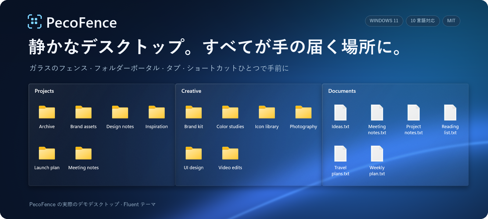

<p align="center">
  
</p>

<p align="center">
  <strong>Windows 11 向けの無料・オープンソースな Stardock Fences 代替アプリ。</strong><br>
  ファイルをガラスのパネルに整理し、ショートカットひとつでどのアプリの手前にも呼び出せます。
</p>

<p align="center">
  <a href="#はじめる"><strong>PecoFence をはじめる →</strong></a>
  &nbsp;·&nbsp; <a href="#実際の動きを見る">実際の動きを見る</a>
  &nbsp;·&nbsp; <a href="../README.md">ドキュメント</a>
</p>

<p align="center">
  <a href="../../README.md">English</a>
  &nbsp;·&nbsp; <a href="README.zh-CN.md">简体中文</a>
  &nbsp;·&nbsp; <a href="README.zh-TW.md">繁體中文</a>
  &nbsp;·&nbsp; <strong>日本語</strong>
  &nbsp;·&nbsp; <a href="README.ko.md">한국어</a>
  &nbsp;·&nbsp; <a href="README.de.md">Deutsch</a>
  &nbsp;·&nbsp; <a href="README.fr.md">Français</a>
  &nbsp;·&nbsp; <a href="README.es.md">Español</a>
  &nbsp;·&nbsp; <a href="README.pt-BR.md">Português (Brasil)</a>
  &nbsp;·&nbsp; <a href="README.ru.md">Русский</a>
</p>

---

## すべてのものに、居場所を

進行中のプロジェクト、撮ったばかりのスクリーンショット、あとで読む資料。それぞれをグループに分けて、
自分の作業スタイルに合わせて並べておけます。PecoFence が添えるのは、デスクトップをもう一度使いやすくするための、ちょうどよい枠組みだけです。

| **作業ごとにまとめる** | **フォルダーを手元に** | **空間を空ける** |
| :--- | :--- | :--- |
| プロジェクトごとにフェンスを作成。ドラッグやサイズ変更、スナップで思いどおりの位置に収まります。 | 実際のフォルダーをデスクトップ上のフェンスとして表示。サブフォルダーへ移動でき、中身の変化もその場で反映されます。 | デスクトップをダブルクリックするとフェンスがすべて隠れ、もう一度ダブルクリックすれば戻ってきます。 |

## 実際の動きを見る

### ひとつのウィンドウに、複数のワークスペース

関連するフェンスはタブとしてひとつにまとめられます。Work から Art へはワンクリックで切り替え、
広く使いたいときはタブをドラッグして外に出すだけです。


### デスクトップは、ショートカットひとつ先に

**Ctrl + Alt + Space** を押すと、フェンスが今使っているアプリの手前に現れます。
必要なものを取ったら、**Esc** で元の画面へ。


<sub>PecoFence 上でデモ用ファイルと Fluent テーマを使って録画したものです。GIF は自動でループします。</sub>

## 毎日の使い心地を変える、小さなこだわり

| 体験 | できること |
| :--- | :--- |
| **整理の手間を減らす** | ファイルの種類、拡張子、名前、ワイルドカード、ショートカットのリンク先、時刻、サイズでルールを設定。新しいファイルは自動で行き先のフェンスに収まります。 |
| **壁紙になじむガラス** | Fluent と Liquid Glass の 2 つのテーマ、ライト／ダークモード、フェンスごとの色合い、不透明度、アイコンの着色。 |
| **慣れた操作のまま** | エクスプローラーの右クリックメニュー、ドラッグ＆ドロップ、コピー／貼り付け、複数選択、サムネイル、アイコン／一覧／詳細の表示切替。 |
| **必要なときだけ広げる** | フェンスをタイトルだけに折りたたみ、ホバーで展開。気に入った配置は位置とサイズを固定できます。 |
| **いつでも元に戻せる** | レイアウトのスナップショット、毎日の自動バックアップ、設定のエクスポート・インポート、ディスプレイ間のフェンス交換。 |
| **軽く、小さく** | Rust で書かれたネイティブアプリ。WebView2 の設定パネルは必要なときだけ読み込まれます。 |

自動整理のルールは、ファイルを元の場所から動かしません。
自分で行った移動などの操作は、エクスプローラーと同じように実際のファイルに反映されます。

[機能一覧をすべて見る →](../FEATURES.md)

## あなたの言語で

**日本語 · English · 简体中文 · 繁體中文 · 한국어**  
**Deutsch · Français · Español · Português (Brasil) · Русский**

**設定 → 全般 → 表示言語** からすぐに切り替えられ、Windows の言語に合わせることもできます。
翻訳はすべて内蔵されていてオフラインでも動作します。ファイル名や自分で付けた名前はそのまま保持されます。

## はじめる

1. このリポジトリの **Releases** ページから `pecofence-<バージョン>-x64.zip` をダウンロードします。
2. **ZIP 全体**をフォルダーに展開し、`pecofence.exe` を実行します。
3. あとは整理を始めるだけ。設定を開くときや終了するときは、トレイアイコンを右クリックしてください。

**Windows 11 x64 · ポータブル ZIP · アカウント不要 · MIT ライセンス**

初回起動時に、選択した言語で「アプリ」「フォルダー」「ファイルとドキュメント」「デスクトップ」の 4 つのフェンスが作成されます。
終了すると、Windows のデスクトップアイコンは元どおり表示されます。

<details>
<summary><strong>動作環境、設定ファイルの場所、知っておきたいこと</strong></summary>

- Windows 11 22H2 以降を対象としています。ネイティブ環境でのテストは主に 25H2 で行っており、
  旧バージョンやマルチディスプレイ構成の網羅的な検証は進行中です。
- 設定画面には Microsoft Edge WebView2 Runtime が必要です。同梱の `WebView2Loader.dll` と
  `pecofence-watchdog.exe` は、アプリと同じフォルダーに置いたままにしてください。
- 設定は `%APPDATA%\PecoFence\config.json` に保存されます。`--portable` を付けて起動すると、
  実行ファイルの隣にある `config` フォルダーに保存されます。
- 既存のインストールでは、以前の設定フォルダーがそのまま使われます。
  詳しくは[アップグレードガイド](../UPGRADING.md)をご覧ください。
- ガラス効果は静止画の壁紙をもとに描画されます。他のアプリのウィンドウや動画壁紙は
  屈折・透過しません。
- Windows 標準のダイアログや、サードパーティ製のエクスプローラーメニュー項目は Windows の言語で表示されます。
- 現在のポータブル版はコード署名されていません。

[ポータブル版ガイド](../PORTABLE.md) · [言語ガイド](../LOCALIZATION.md)

</details>

## 自分でビルドして、自分のものに

PecoFence は MIT ライセンスで公開されています。訳文の一言をより自然にすることから、
デスクトップ操作の改善まで、あらゆる貢献を歓迎します。

[貢献する](../../CONTRIBUTING.md) · [翻訳を改善する](../LOCALIZATION.md) · [開発ガイド](../DEVELOPMENT.md)

<details>
<summary><strong>ソースからビルドする</strong></summary>

Rust stable と、C++ ワークロードおよび Windows SDK を含む Visual Studio Build Tools をインストールします。

```powershell
cargo build --locked --release
Copy-Item third_party/webview2/WebView2Loader.x64.dll target/release/WebView2Loader.dll
```

配布用のポータブル ZIP を作成するには：

```powershell
./scripts/make-portable.ps1
```

ワークスペースの構成は、ネイティブアプリが `crates/`、設定画面が `ui/`、翻訳が `locales/`、
検証とパッケージ用スクリプトが `scripts/` です。`extras/` にあるオプションの動画プロジェクトは、アプリのビルドとは独立しています。

[リリース手順](../RELEASING.md) · [ソース構成](../DEVELOPMENT.md#architecture)

</details>

---

**戻ってくるのが楽しみになるデスクトップのために。**  
[MIT ライセンス](../../LICENSE) · [サードパーティライセンス](../../third_party/README.md)
