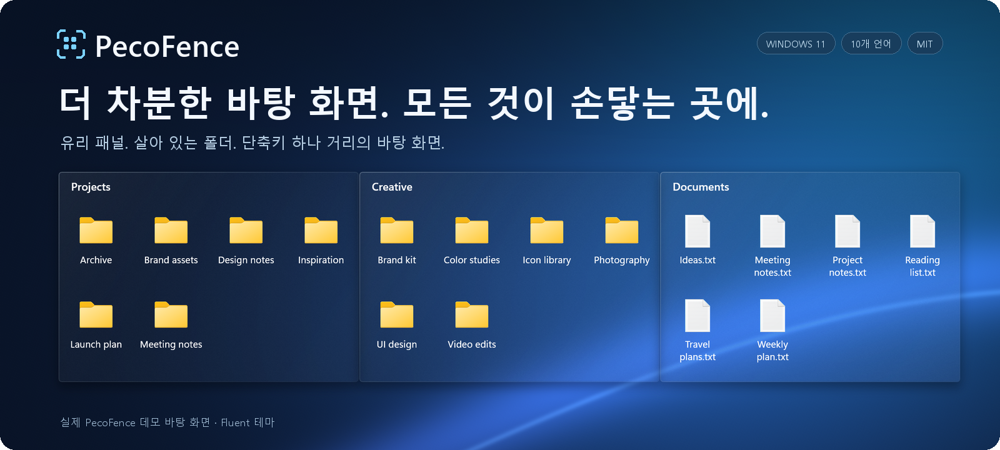

<p align="center">
  
</p>

https://github.com/user-attachments/assets/6320cf28-a791-4720-9659-b4575df021a0

<p align="center">
  <strong>Windows 11을 위한 무료 오픈 소스 Stardock Fences 대안.</strong><br>
  파일을 유리 패널에 정리하고, 단축키 하나로 어떤 앱 위에든 불러오세요.
</p>

<p align="center">
  <a href="#pecofence-시작하기"><strong>PecoFence 시작하기 →</strong></a>
  &nbsp;·&nbsp; <a href="#실제-동작-보기">실제 동작 보기</a>
  &nbsp;·&nbsp; <a href="../README.md">문서</a>
</p>

<p align="center">
  <a href="../../README.md">English</a>
  &nbsp;·&nbsp; <a href="README.zh-CN.md">简体中文</a>
  &nbsp;·&nbsp; <a href="README.zh-TW.md">繁體中文</a>
  &nbsp;·&nbsp; <a href="README.ja.md">日本語</a>
  &nbsp;·&nbsp; <strong>한국어</strong>
  &nbsp;·&nbsp; <a href="README.de.md">Deutsch</a>
  &nbsp;·&nbsp; <a href="README.fr.md">Français</a>
  &nbsp;·&nbsp; <a href="README.es.md">Español</a>
  &nbsp;·&nbsp; <a href="README.pt-BR.md">Português (Brasil)</a>
  &nbsp;·&nbsp; <a href="README.ru.md">Русский</a>
</p>

---

## 모든 것에 제자리를

진행 중인 프로젝트, 방금 찍은 스크린샷, 나중에 읽을 자료—각자의 펜스에 담아
내가 일하는 방식대로 배치하세요. PecoFence는 바탕 화면이 다시 쓸모 있어질 만큼의
구조만 딱 더해 줍니다.

| **프로젝트별로 묶기** | **폴더를 가까이에** | **공간 비우기** |
| :--- | :--- | :--- |
| 프로젝트마다 펜스를 만들고, 끌어서 옮기고 크기를 조절하고 맞춤으로 딱 맞게 정렬하세요. | 실제 폴더를 바탕 화면 위에 그대로 올려 두세요. 하위 폴더를 탐색할 수 있고, 변경 사항은 바로 반영됩니다. | 바탕 화면을 두 번 클릭하면 펜스가 모두 숨겨지고, 다시 두 번 클릭하면 돌아옵니다. |

## 실제 동작 보기

### 창은 하나, 작업 공간은 여러 개

관련 있는 펜스를 탭으로 묶어 두세요. 클릭 한 번으로 Work에서 Art로 넘어가고,
더 넓게 쓰고 싶을 때는 탭을 끌어내어 독립된 펜스로 만들 수 있습니다.


### 바탕 화면이 단축키 하나 거리에

**Ctrl + Alt + 스페이스**를 누르면 현재 앱 위로 펜스가 떠오릅니다.
필요한 것을 집어 든 뒤 **Esc**를 누르면 하던 일로 돌아갑니다.


<sub>데모 파일과 Fluent 테마로 PecoFence에서 직접 녹화했습니다. GIF는 자동으로 반복 재생됩니다.</sub>

## 작은 디테일이 매일을 편하게

| 경험 | 이렇게 달라집니다 |
| :--- | :--- |
| **정리는 덜** | 파일 유형, 확장자, 이름, 와일드카드, 바로 가기 대상, 시간과 크기로 규칙을 정해 두면 새 파일이 알아서 제 펜스를 찾아갑니다. |
| **바탕 화면에 어울리는 유리** | Fluent와 Liquid Glass 테마, 밝게/어둡게 모드, 펜스별 색조와 불투명도, 아이콘 색조. |
| **익숙한 파일 다루기** | 파일 탐색기 우클릭 메뉴, 끌어서 놓기, 복사/붙여넣기, 다중 선택, 썸네일, 아이콘/목록/자세히 보기. |
| **필요할 때는 공간을** | 펜스를 제목만 남기고 접어 두고, 마우스를 올리면 펼치세요. 마음에 드는 배치는 잠가 둘 수 있습니다. |
| **되돌아갈 길** | 배치 스냅샷, 매일 자동 백업, 설정 내보내기 / 가져오기, 디스플레이 간 펜스 교환. |
| **가벼운 존재감** | Rust로 만든 네이티브 앱. WebView2 설정 패널은 필요할 때만 로드됩니다. |

자동 정리 규칙은 파일을 원래 위치에 그대로 둡니다. 직접 파일을 옮길 때는
파일 탐색기에서처럼 실제 파일이 이동합니다.

[전체 기능 목록 보기 →](../FEATURES.md)

## 내 언어로

**한국어 · English · 简体中文 · 繁體中文 · 日本語**  
**Deutsch · Français · Español · Português (Brasil) · Русский**

**설정 → 일반 → 표시 언어**에서 바로 바꾸거나 Windows 설정을 따르세요.
모든 번역이 내장되어 오프라인에서도 동작합니다. 파일 이름과 직접 지은 이름은 그대로 유지됩니다.

## PecoFence 시작하기

1. 이 저장소의 **Releases** 페이지에서 `pecofence-<버전>-x64.zip`을 다운로드합니다.
2. **ZIP 전체**를 한 폴더에 풀고 `pecofence.exe`를 실행합니다.
3. 이제 정리를 시작하세요. 설정을 열거나 종료하려면 트레이 아이콘을 오른쪽 클릭하면 됩니다.

패키지 관리자를 선호한다면 `winget install DayuanJiang.PecoFence`로 같은 포터블 빌드를 설치할 수 있고, SmartScreen 경고도 나타나지 않습니다.

**Windows 11 x64 · 포터블 ZIP · 계정 불필요 · MIT 라이선스**

처음 실행하면 선택한 언어로 프로그램, 폴더, 파일 및 문서, 바탕 화면 펜스가 만들어집니다.
종료하면 Windows 바탕 화면 아이콘이 다시 표시됩니다.

<details>
<summary><strong>요구 사항, 설정 위치, 알아 두면 좋은 점</strong></summary>

- Windows 11 22H2 이상을 대상으로 합니다. 네이티브 테스트는 대부분 25H2에서 진행했으며,
  이전 버전과 다중 디스플레이 하드웨어 조합에 대한 전체 검증은 아직 진행 중입니다.
- 설정 화면에는 Microsoft Edge WebView2 Runtime이 필요합니다. 함께 제공되는
  `WebView2Loader.dll`과 `pecofence-watchdog.exe`는 앱 옆에 그대로 두세요.
- 설정은 `%APPDATA%\PecoFence\config.json`에 저장됩니다. `--portable`로 실행하면
  실행 파일 옆의 `config` 폴더에 보관합니다.
- 기존 설치는 이전 설정 디렉터리를 그대로 사용합니다.
  [업그레이드 안내](../UPGRADING.md)를 참고하세요.
- 유리 효과는 정적 바탕 화면 배경을 사용합니다. 다른 앱 창이나 동영상 배경 화면은
  굴절하지 않습니다.
- Windows 자체 대화 상자와 타사 파일 탐색기 메뉴 항목은 Windows 언어를 따릅니다.
- 포터블 빌드는 코드 서명이 되어 있지 않습니다. 첫 실행 때 Windows SmartScreen이 나타나면 **추가 정보 → 실행**을 선택하세요.
  winget으로 설치하면 이 경고가 나타나지 않습니다.

[포터블 버전 안내](../PORTABLE.md) · [언어 안내](../LOCALIZATION.md)

</details>

## 직접 빌드하고, 내 것으로

PecoFence는 MIT 라이선스로 공개되어 있습니다. 더 정확한 번역 한 줄부터 더 나은
바탕 화면 상호작용까지, 어떤 기여든 환영합니다.

[기여하기](../../CONTRIBUTING.md) · [번역 개선하기](../LOCALIZATION.md) · [개발 가이드](../DEVELOPMENT.md)

<details>
<summary><strong>소스에서 빌드하기</strong></summary>

Rust stable과 C++ 워크로드 및 Windows SDK가 포함된 Visual Studio Build Tools를 설치합니다.

```powershell
cargo build --locked --release
Copy-Item third_party/webview2/WebView2Loader.x64.dll target/release/WebView2Loader.dll
```

배포용 포터블 ZIP 만들기:

```powershell
./scripts/make-portable.ps1
```

워크스페이스는 네이티브 앱의 `crates/`, 설정 화면의 `ui/`, 번역의 `locales/`,
검증 및 패키징 스크립트의 `scripts/`로 구성됩니다.
`extras/`의 선택적 동영상 프로젝트는 앱 빌드와 무관합니다.

[릴리스 안내](../RELEASING.md) · [소스 구조](../DEVELOPMENT.md#architecture)

</details>

---

**돌아오고 싶어지는 바탕 화면을 위해.**  
[MIT 라이선스](../../LICENSE) · [타사 고지](../../third_party/README.md)
