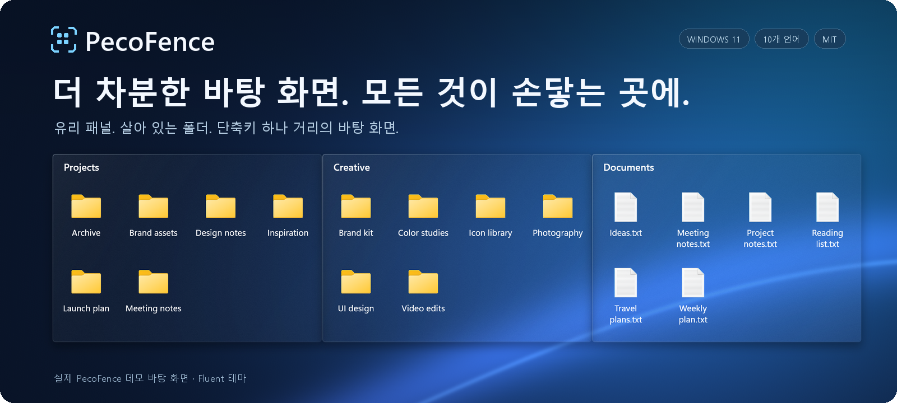
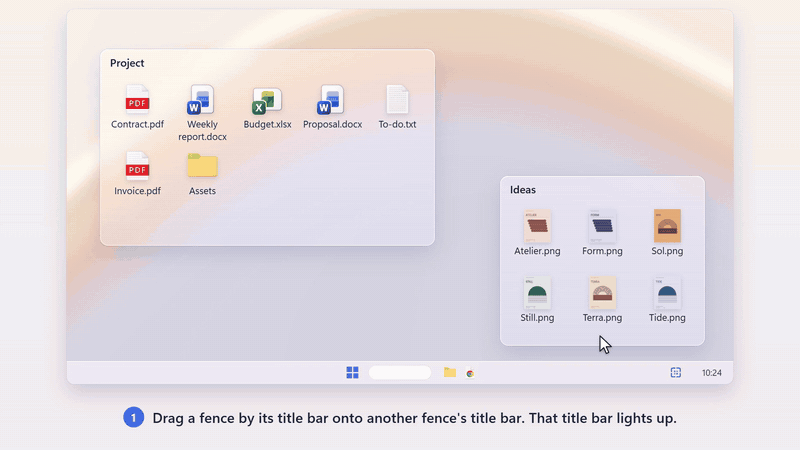
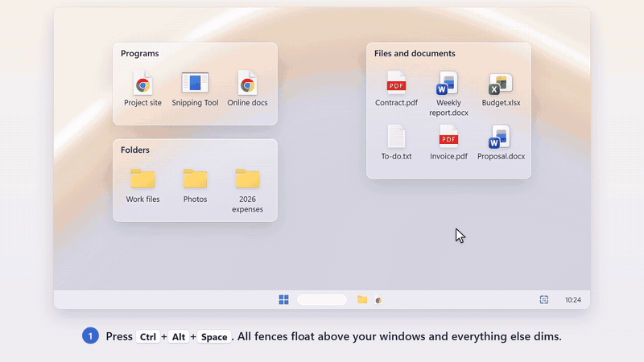

https://github.com/user-attachments/assets/c827f059-cfd7-4f6a-bed3-8b00411a7220

<p align="center">
  <strong>Windows 11용 무료 오픈 소스 Stardock Fences 대안.</strong><br>
  유리 펜스에 파일을 모으고 탭으로 프로젝트를 전환하세요. 내장 CLI로 AI 에이전트에게 배치, 모양, 자동 정리 규칙 설정도 맡길 수 있습니다.
</p>

<p align="center">
  <a href="https://pecofence.jiang.jp/ko/"><strong>공식 웹사이트</strong></a>
  &nbsp;·&nbsp; <a href="#pecofence-시작하기"><strong>PecoFence 시작하기 →</strong></a>
  &nbsp;·&nbsp; <a href="#원하는-바탕-화면을-ai에게-말해-보세요"><strong>AI + CLI</strong></a>
  &nbsp;·&nbsp; <a href="#실제-동작-보기">실제 동작 보기</a>
  &nbsp;·&nbsp; <a href="../README.md">문서</a>
</p>

<p align="center">
  <a href="../../README.md">English</a>
  &nbsp;·&nbsp; <a href="README.zh-CN.md">简体中文</a>
  &nbsp;·&nbsp; <a href="README.zh-TW.md">繁體中文</a>
  &nbsp;·&nbsp; <a href="README.ja.md">日本語</a>
  &nbsp;·&nbsp; <strong>한국어</strong>
  &nbsp;·&nbsp; <a href="README.de.md">Deutsch</a>
  &nbsp;·&nbsp; <a href="README.fr.md">Français</a>
  &nbsp;·&nbsp; <a href="README.es.md">Español</a>
  &nbsp;·&nbsp; <a href="README.pt-BR.md">Português (Brasil)</a>
  &nbsp;·&nbsp; <a href="README.ru.md">Русский</a>
</p>

---

<a id="ai에게-정리를-맡기세요"></a>

## 원하는 바탕 화면을 AI에게 말해 보세요

**CLI 내장. AI 에이전트에게 바로 맡기세요.**

바탕 화면을 어떻게 쓰고 싶은지 AI 에이전트에게 알려 주세요. 함께 제공되는 `pecofence-cli`로 Claude Code, Codex, Cursor가 현재 설정을 읽고 PecoFence에 바로 변경 사항을 적용합니다.

- **말로 요청하고 바로 설정하세요.** 테마, 불투명도, 아이콘 크기, 앱 전체 설정을 바꾸거나 모든 펜스를 한 번에 조정할 수 있습니다.
- **한 번 정리하면 이후에는 자동으로.** 프로젝트별 펜스를 만들고 아이콘을 정리하세요. 규칙을 추가하면 새 파일도 자동으로 분류됩니다.
- **마음에 드는 설정을 보관하세요.** 스냅샷으로 펜스 배치를 저장하고, 설정 내보내기/가져오기로 규칙과 배치까지 모두 백업하고 복원할 수 있습니다.

**사용 중인 AI 에이전트로 시작하세요**

PecoFence를 실행한 뒤, 아래 요청을 AI 코딩 에이전트에 붙여 넣으세요.

> pecofence-cli로 내 바탕 화면을 설정해 주세요. 먼저 pecofence-cli skill과 pecofence-cli describe를 읽고 현재 설정과 펜스를 확인해 주세요. 변경하기 전에 설정을 백업하고, 다크 모드로 바꾼 다음 모든 펜스를 좀 더 투명하게 해 주세요.

CLI는 앱에 포함되어 있습니다. Microsoft Store 버전은 `pecofence-cli`를 PATH에 추가합니다. 포터블 ZIP에서는 에이전트에게 `pecofence-cli.exe`의 전체 경로를 알려 주세요.

<details>
<summary><strong>코딩 에이전트와의 대화 예시</strong></summary>

> 바탕 화면의 PDF를 Docs 펜스에 모으고 새 PDF도 자동으로 넣어 줘. 다크 모드로 바꾸고 펜스를 좀 더 투명하게 해 줘.

```powershell
pecofence-cli config export "$env:USERPROFILE\pecofence-before-ai.json"
pecofence-cli snapshot save before-cleanup
pecofence-cli fence create --title Docs
pecofence-cli rule add --name PDFs --ext pdf --to Docs --index 0
pecofence-cli rule apply
pecofence-cli settings set theme dark
pecofence-cli fence set --all opacity clear
```

</details>

AI와 스크립트를 위한 인터페이스: `describe`는 명령 목록과 JSON Schema를, `skill`은 에이전트 가이드를 출력합니다. JSON 결과로 실제 변경 내용을 확인하고, 구조화된 앱 오류를 바탕으로 다음 작업을 결정할 수 있습니다.

[CLI 시작 가이드 →](../CLI.md#start-with-your-ai-agent)

## 모든 것에 제자리를

진행 중인 프로젝트, 방금 찍은 스크린샷, 나중에 읽을 자료를 각자의 펜스에 담아
내가 일하는 방식대로 배치하세요. PecoFence는 꼭 필요한 만큼만 정리해
바탕 화면을 다시 쓸모 있게 만들어 줍니다.

<p align="center">
  
</p>

| **프로젝트별로 묶기** | **폴더를 가까이에** | **공간 비우기** |
| :--- | :--- | :--- |
| 프로젝트마다 펜스를 만들고, 끌어서 옮기거나 크기를 조절해 다른 펜스 옆에 착 맞춰 두세요. | 실제 폴더를 바탕 화면 위에 그대로 올려 두세요. 하위 폴더를 탐색할 수 있고, 변경 사항은 바로 반영됩니다. | 바탕 화면을 두 번 클릭하면 펜스가 모두 숨겨지고, 다시 두 번 클릭하면 돌아옵니다. |

## 실제 동작 보기

### 펜스는 하나, 작업 공간은 여러 개

관련 있는 펜스를 탭으로 묶어 두세요. 클릭 한 번으로 Project에서 Ideas로 넘어가고,
더 넓게 쓰고 싶을 때는 탭을 끌어내어 독립된 펜스로 만들 수 있습니다.



### 단축키 하나로 바탕 화면을 눈앞에

**Ctrl + Alt + 스페이스바**를 누르면 펜스 미리 보기가 열려 현재 앱 위로 펜스가 떠오릅니다.
필요한 파일을 꺼내 쓴 뒤 **Esc**를 누르면 하던 일로 돌아갑니다.



<sub><a href="https://pecofence.jiang.jp/ko/manual/">사용 설명서</a>에 있는 애니메이션입니다. GIF는 자동으로 반복 재생됩니다.</sub>

## 작은 디테일이 매일을 편하게

| 기능 | 이렇게 달라집니다 |
| :--- | :--- |
| **AI + CLI** | `pecofence-cli` — **말로 요청하고 바로 설정하세요.** 테마, 불투명도, 아이콘 크기, 앱 전체 설정을 바꾸거나 모든 펜스를 한 번에 조정할 수 있습니다. |
| **정리는 규칙에 맡기세요** | 파일 유형, 확장자, 이름, 와일드카드, 바로 가기 대상, 시간과 크기로 규칙을 정해 두면 새 파일이 알아서 제 펜스를 찾아갑니다. |
| **바탕 화면에 어울리는 유리** | Fluent와 Liquid Glass 테마, 밝은/어두운 모드, 펜스별 색조와 불투명도, 아이콘 색조. |
| **익숙한 파일 다루기** | 파일 탐색기 오른쪽 클릭 메뉴, 끌어서 놓기, 복사/붙여넣기, 다중 선택, 썸네일, 아이콘/목록/자세히 보기. |
| **필요할 때는 공간을** | 펜스를 제목만 남기고 접어 두고, 마우스를 올리면 펼치세요. 마음에 드는 배치는 잠가 둘 수 있습니다. |
| **되돌아갈 길** | 배치 스냅샷, 매일 자동 백업, 설정 내보내기 / 가져오기, 디스플레이 간 펜스 교환. |
| **가볍고 빠르게** | Rust로 만든 네이티브 앱. 대기 중 메모리 사용량은 작업 관리자 기준 약 40 MB입니다. WebView2 설정 화면은 열 때만 로드됩니다. |

자동 정리 규칙은 파일을 원래 위치에 그대로 둡니다. 직접 파일을 옮길 때는
파일 탐색기에서처럼 실제 파일이 이동합니다.

[전체 기능 목록 보기 →](../FEATURES.md)

## PecoFence 시작하기

<a href="https://apps.microsoft.com/detail/9MV6WG3XNWSX?mode=direct"></a>

Microsoft Store 버전은 Microsoft가 서명하고 자동으로 업데이트되며 SmartScreen 경고가 나타나지 않습니다. ZIP 파일이 편하다면 아래 포터블 빌드를 받으세요. 같은 앱입니다.

1. 이 저장소의 **Releases** 페이지에서 `pecofence-v<버전>-x64-portable.zip`을 다운로드합니다.
2. **ZIP 전체**를 한 폴더에 풀고 `pecofence.exe`를 실행합니다.
3. 이제 정리를 시작하세요. 설정을 열거나 종료하려면 트레이 아이콘을 오른쪽 클릭하면 됩니다.

설치 프로그램이 편하다면 같은 페이지의 `pecofence-v<버전>-x64-setup.exe`를 사용하세요. 현재 사용자에게만 설치되고 시작 메뉴 항목과 제거 프로그램이 추가됩니다. 설정은 ZIP 버전과 함께 씁니다.

패키지 관리자가 편하다면 `winget install DayuanJiang.PecoFence`로 같은 포터블 빌드를 설치할 수 있고, SmartScreen 경고도 나타나지 않습니다.

**Windows 10 22H2 / Windows 11 x64 · 메모리 약 40 MB · 포터블 ZIP · 계정 불필요 · Apache 2.0 라이선스**

처음 실행하면 선택한 언어로 “프로그램”, “폴더”, “파일 및 문서”, “바탕 화면” 펜스가 만들어집니다.
종료하면 Windows 바탕 화면 아이콘이 다시 표시됩니다.

<details>
<summary><strong>요구 사항, 설정 위치, 알아 두면 좋은 점</strong></summary>

- Windows 10 22H2와 Windows 11 22H2 이상을 대상으로 합니다. 실제 기기 테스트는 주로 Windows 11 25H2에서
  진행했으며, 이전 버전과 여러 디스플레이 하드웨어 조합은 아직 검증 중입니다. Windows 10에서는 글꼴로
  Segoe UI, 아이콘으로 Segoe MDL2 Assets를 사용하며 설정 창과 알림 창의 모서리가 둥글지 않습니다.
- 설정 화면에는 Microsoft Edge WebView2 Runtime이 필요합니다. Windows 11에는 포함되어 있고, Windows 10에서
  설정이 열리지 않으면 Microsoft 사이트에서 설치하세요. 함께 제공되는
  `WebView2Loader.dll`과 `pecofence-watchdog.exe`는 앱 옆에 그대로 두세요.
- 설정은 `%APPDATA%\PecoFence\config.json`에 저장됩니다. `--portable`로 실행하면
  실행 파일 옆의 `config` 폴더에 보관합니다.
- 기존 설치는 이전 설정 폴더를 그대로 사용합니다.
  [업그레이드 안내](../UPGRADING.md)를 참고하세요.
- 유리 효과는 정적인 배경 화면만 반영합니다. 다른 앱 창이나 동영상 배경 화면은
  유리에 비치지 않습니다.
- Windows 자체 대화 상자와 타사 파일 탐색기 메뉴 항목은 Windows 표시 언어를 따릅니다.
- 포터블 빌드는 코드 서명이 되어 있지 않습니다. 첫 실행 때 Windows SmartScreen이 나타나면 **추가 정보 → 실행**을 선택하세요.
  Microsoft Store나 winget으로 설치하면 이 경고가 나타나지 않습니다.

[포터블 버전 안내](../PORTABLE.md) · [언어 안내](../LOCALIZATION.md) · [Windows 설치 버전 안내](../INSTALLER.md)

</details>

## 직접 빌드하고, 내 것으로

PecoFence는 Apache 2.0 라이선스로 공개되어 있습니다. 더 정확한 번역 한 줄부터 더 나은
바탕 화면 상호작용까지, 어떤 기여든 환영합니다.

[기여하기](../../CONTRIBUTING.md) · [번역 개선하기](../LOCALIZATION.md) · [개발 가이드](../DEVELOPMENT.md)

<details>
<summary><strong>소스에서 빌드하기</strong></summary>

Rust stable과 C++ 워크로드 및 Windows SDK가 포함된 Visual Studio Build Tools를 설치합니다.

```powershell
cargo build --locked --release
Copy-Item third_party/webview2/WebView2Loader.x64.dll target/release/WebView2Loader.dll
```

배포용 포터블 ZIP 만들기:

```powershell
./scripts/make-portable.ps1
```

워크스페이스에서 네이티브 앱은 `crates/`, 설정 화면은 `ui/`, 번역은 `locales/`,
검증 및 패키징 스크립트는 `scripts/`에 있습니다.
제품 웹사이트는 `site/`에 있으며, `extras/`의 선택적 동영상 프로젝트는 앱 빌드와 무관합니다.

[릴리스 안내](../RELEASING.md) · [소스 구조](../DEVELOPMENT.md#architecture)

</details>

---

**돌아오고 싶어지는 바탕 화면을 위해.**  
[Apache 2.0 라이선스](../../LICENSE) · [타사 고지](../../third_party/README.md)
