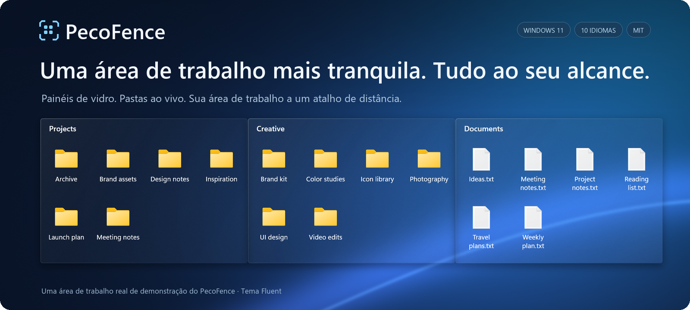

<p align="center">
  
</p>

https://github.com/user-attachments/assets/6320cf28-a791-4720-9659-b4575df021a0

<p align="center">
  <strong>Uma alternativa gratuita e de código aberto ao Stardock Fences para Windows 11.</strong><br>
  Organize seus arquivos em painéis de vidro. Traga-os por cima de qualquer aplicativo com um atalho.
</p>

<p align="center">
  <a href="#baixe-o-pecofence"><strong>Baixe o PecoFence →</strong></a>
  &nbsp;·&nbsp; <a href="#veja-em-ação">Veja em ação</a>
  &nbsp;·&nbsp; <a href="../README.md">Documentação</a>
</p>

<p align="center">
  <a href="../../README.md">English</a>
  &nbsp;·&nbsp; <a href="README.zh-CN.md">简体中文</a>
  &nbsp;·&nbsp; <a href="README.zh-TW.md">繁體中文</a>
  &nbsp;·&nbsp; <a href="README.ja.md">日本語</a>
  &nbsp;·&nbsp; <a href="README.ko.md">한국어</a>
  &nbsp;·&nbsp; <a href="README.de.md">Deutsch</a>
  &nbsp;·&nbsp; <a href="README.fr.md">Français</a>
  &nbsp;·&nbsp; <a href="README.es.md">Español</a>
  &nbsp;·&nbsp; <strong>Português (Brasil)</strong>
  &nbsp;·&nbsp; <a href="README.ru.md">Русский</a>
</p>

---

## Dê um lugar a cada coisa

Projetos, capturas de tela, coisas para ler depois: cada uma em seu próprio grupo, organizada
do jeito que você trabalha. O PecoFence adiciona só a estrutura necessária para a sua área de
trabalho voltar a ser útil.

| **Agrupe seu trabalho** | **Pastas sempre à mão** | **Libere espaço** |
| :--- | :--- | :--- |
| Crie um grupo para cada projeto. Arraste, redimensione e encaixe no lugar. | Coloque uma pasta ao vivo na área de trabalho. Navegue pelas subpastas e veja as mudanças na hora. | Clique duas vezes na área de trabalho para ocultar os grupos. Clique duas vezes de novo para trazê-los de volta. |

## Veja em ação

### Uma janela. Vários espaços de trabalho.

Mantenha grupos relacionados juntos como abas. Passe de Work para Art com um clique
e arraste uma aba para fora quando precisar de mais espaço.


### Sua área de trabalho a um atalho de distância.

Pressione **Ctrl + Alt + Espaço** para trazer seus grupos por cima do aplicativo atual.
Pegue o que precisa e pressione **Esc** para voltar.


<sub>Gravado no PecoFence com arquivos de demonstração e o tema Fluent. Os GIFs repetem automaticamente.</sub>

## Pequenos detalhes que fazem diferença no dia a dia

| Experiência | O que você ganha |
| :--- | :--- |
| **Menos arrumação** | Regras por tipo de arquivo, extensão, nome, curinga, destino do atalho, horário e tamanho. Arquivos novos encontram seu grupo sozinhos. |
| **Vidro que combina com sua área de trabalho** | Temas Fluent e Liquid Glass, modos claro e escuro, cor por grupo, opacidade e cor dos ícones. |
| **Arquivos do jeito que você conhece** | Menus de contexto do Explorador de Arquivos, arrastar e soltar, copiar e colar, seleção múltipla, miniaturas e exibição em ícones, lista ou detalhes. |
| **Espaço quando você precisa** | Recolha um grupo até o título. Passe o mouse para expandir. Bloqueie um layout que você gostou. |
| **Um caminho de volta** | Instantâneos de layout, backups diários, importação e exportação da configuração e troca entre monitores. |
| **Leve de verdade** | Um aplicativo nativo em Rust; o painel de configurações em WebView2 só carrega quando necessário. |

As regras de organização automática mantêm os arquivos onde eles estão. As movimentações
que você mesmo inicia funcionam como no Explorador de Arquivos.

[Conheça a lista completa de recursos →](../FEATURES.md)

## Fala a sua língua

**Português (Brasil) · English · 简体中文 · 繁體中文 · 日本語**  
**한국어 · Deutsch · Français · Español · Русский**

Troque na hora em **Configurações → Geral → Idioma de exibição** ou siga o idioma do Windows.
Todas as traduções vêm incluídas e funcionam offline. Seus nomes de arquivos e nomes
personalizados são preservados.

## Baixe o PecoFence

1. Abra a página **Releases** deste repositório e baixe `pecofence-<versão>-x64.zip`.
2. Extraia o **ZIP inteiro** para uma pasta e execute `pecofence.exe`.
3. Comece a organizar. Clique com o botão direito no ícone da bandeja sempre que precisar
   das Configurações ou quiser sair.

**Windows 11 x64 · ZIP portátil · Sem conta · Licença MIT**

Na primeira execução são criados os grupos Programas, Pastas, Arquivos e documentos e
Área de trabalho no idioma escolhido. Os ícones da área de trabalho do Windows voltam
a aparecer quando você sai.

<details>
<summary><strong>Requisitos, configuração e algumas observações úteis</strong></summary>

- Feito para o Windows 11 22H2 ou mais recente. A maior parte dos testes nativos foi no 25H2;
  a matriz completa de versões antigas e configurações com vários monitores ainda está em andamento.
- O Microsoft Edge WebView2 Runtime é necessário para as Configurações. Mantenha
  `WebView2Loader.dll` e `pecofence-watchdog.exe` na mesma pasta do aplicativo.
- A configuração fica em `%APPDATA%\PecoFence\config.json`. Inicie com
  `--portable` para mantê-la em uma pasta `config` ao lado do executável.
- Instalações existentes continuam usando o diretório de configuração anterior.
  Veja o [guia de atualização](../UPGRADING.md).
- O vidro usa o papel de parede estático. Ele não refrata outros aplicativos
  nem papéis de parede em vídeo.
- Caixas de diálogo do Windows e entradas de terceiros no menu do Explorador de Arquivos
  seguem o idioma do Windows.
- As versões portáteis atuais não são assinadas.

[Guia da edição portátil](../PORTABLE.md) · [Guia de idiomas](../LOCALIZATION.md)

</details>

## Compile. Deixe do seu jeito.

O PecoFence usa a licença MIT, e contribuições são bem-vindas: de uma tradução mais precisa
a uma interação melhor na área de trabalho.

[Contribua](../../CONTRIBUTING.md) · [Melhore uma tradução](../LOCALIZATION.md) · [Guia de desenvolvimento](../DEVELOPMENT.md)

<details>
<summary><strong>Compilar a partir do código-fonte</strong></summary>

Instale o Rust stable e o Visual Studio Build Tools com a carga de trabalho C++ e o Windows SDK.

```powershell
cargo build --locked --release
Copy-Item third_party/webview2/WebView2Loader.x64.dll target/release/WebView2Loader.dll
```

Para gerar um ZIP portátil distribuível:

```powershell
./scripts/make-portable.ps1
```

O workspace está organizado em `crates/` para o aplicativo nativo, `ui/` para as Configurações,
`locales/` para as traduções e `scripts/` para verificação e empacotamento.
O projeto de vídeo opcional em `extras/` é independente da compilação do aplicativo.

[Instruções de lançamento](../RELEASING.md) · [Estrutura do código](../DEVELOPMENT.md#architecture)

</details>

---

**Feito para uma área de trabalho à qual você gosta de voltar.**  
[Licença MIT](../../LICENSE) · [Avisos de terceiros](../../third_party/README.md)
