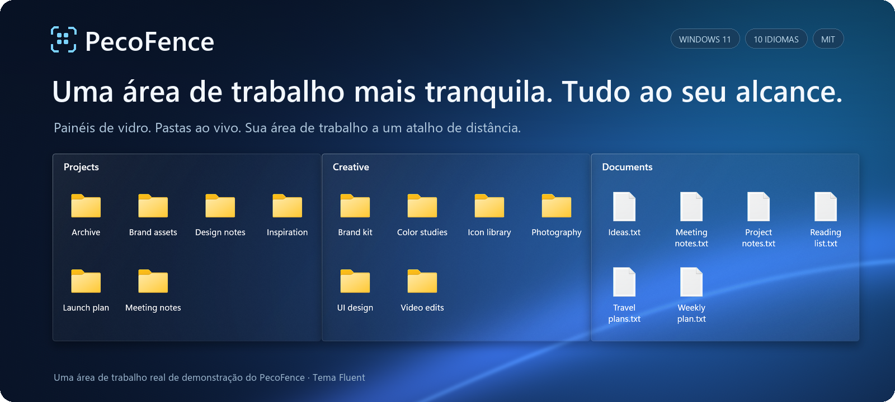

https://github.com/user-attachments/assets/c827f059-cfd7-4f6a-bed3-8b00411a7220

<p align="center">
  <strong>Uma alternativa gratuita e de código aberto ao Stardock Fences para Windows 11.</strong><br>
  Agrupe arquivos em painéis de vidro, alterne entre projetos com abas e deixe seu agente de IA configurar o layout, a aparência e as regras de organização pela CLI integrada.
</p>

<p align="center">
  <a href="https://pecofence.jiang.jp/pt-BR/"><strong>Site oficial</strong></a>
  &nbsp;·&nbsp; <a href="#baixe-o-pecofence"><strong>Baixe o PecoFence →</strong></a>
  &nbsp;·&nbsp; <a href="#sua-área-de-trabalho-configurada-pela-sua-ia"><strong>IA + CLI</strong></a>
  &nbsp;·&nbsp; <a href="#veja-em-ação">Veja em ação</a>
  &nbsp;·&nbsp; <a href="../README.md">Documentação</a>
</p>

<p align="center">
  <a href="../../README.md">English</a>
  &nbsp;·&nbsp; <a href="README.zh-CN.md">简体中文</a>
  &nbsp;·&nbsp; <a href="README.zh-TW.md">繁體中文</a>
  &nbsp;·&nbsp; <a href="README.ja.md">日本語</a>
  &nbsp;·&nbsp; <a href="README.ko.md">한국어</a>
  &nbsp;·&nbsp; <a href="README.de.md">Deutsch</a>
  &nbsp;·&nbsp; <a href="README.fr.md">Français</a>
  &nbsp;·&nbsp; <a href="README.es.md">Español</a>
  &nbsp;·&nbsp; <strong>Português (Brasil)</strong>
  &nbsp;·&nbsp; <a href="README.ru.md">Русский</a>
</p>

---

<a id="peça-à-sua-ia-para-organizar"></a>

## Sua área de trabalho, configurada pela sua IA

**CLI incluída. Pronta para seu agente de IA.**

Diga ao seu agente de IA como você quer usar a área de trabalho. Com a `pecofence-cli` incluída no aplicativo, Claude Code, Codex e Cursor podem ler sua configuração atual e aplicar mudanças diretamente no PecoFence.

- **Configure com suas próprias palavras.** Altere temas, transparência, tamanho dos ícones e configurações globais, ou ajuste todos os grupos de uma vez.
- **Organize uma vez e mantenha a ordem.** Crie grupos por projeto, distribua os ícones e adicione regras para organizar novos arquivos automaticamente.
- **Salve a configuração de que você gosta.** Use instantâneos para os layouts dos grupos e a exportação e importação de configuração para ajustes, regras e layouts.

**Experimente com seu agente de IA**

Abra o PecoFence e cole este pedido no seu agente de programação com IA:

> Configure minha área de trabalho com pecofence-cli. Primeiro leia pecofence-cli skill e pecofence-cli describe e confira minhas configurações e grupos atuais. Faça um backup da configuração antes de alterá-la. Ative o modo escuro e deixe todos os grupos mais transparentes.

A CLI já está incluída. A edição da Microsoft Store adiciona `pecofence-cli` ao PATH. Com o ZIP portátil, informe ao agente o caminho completo de `pecofence-cli.exe`.

<details>
<summary><strong>Exemplo de conversa com um agente de programação</strong></summary>

> Coloque os PDFs da minha área de trabalho em um grupo Docs e organize os novos PDFs nele também. Ative o modo escuro e deixe os grupos mais transparentes.

```powershell
pecofence-cli config export "$env:USERPROFILE\pecofence-before-ai.json"
pecofence-cli snapshot save before-cleanup
pecofence-cli fence create --title Docs
pecofence-cli rule add --name PDFs --ext pdf --to Docs --index 0
pecofence-cli rule apply
pecofence-cli settings set theme dark
pecofence-cli fence set --all opacity clear
```

</details>

Para agentes e scripts: `describe` fornece o catálogo de comandos e os esquemas JSON; `skill`, o guia do agente. Os resultados JSON mostram as alterações, e os erros estruturados do aplicativo ajudam o agente a escolher o próximo passo.

[Primeiros passos com a CLI →](../CLI.md#start-with-your-ai-agent)

## Dê um lugar a cada coisa

<p align="center">
  
</p>

## Veja em ação

### Uma janela. Vários espaços de trabalho.

Mantenha grupos relacionados juntos como abas. Passe de Project para Ideas com um clique
e arraste uma aba para fora quando precisar de mais espaço.


### Sua área de trabalho a um atalho de distância.

Pressione **Ctrl + Alt + Espaço** para espiar seus grupos por cima do aplicativo atual.
Pegue o que precisa e pressione **Esc** para voltar.


<sub>Animações do <a href="https://pecofence.jiang.jp/pt-BR/manual/">manual</a>. Os GIFs se repetem automaticamente.</sub>

## Pequenos detalhes que fazem diferença no dia a dia

| Experiência | O que você ganha |
| :--- | :--- |
| **IA + CLI** | `pecofence-cli` — **Configure com suas próprias palavras.** Altere temas, transparência, tamanho dos ícones e configurações globais, ou ajuste todos os grupos de uma vez. |
| **Menos arrumação** | Regras por tipo de arquivo, extensão, nome, curinga, destino do atalho, horário e tamanho. Arquivos novos encontram seu grupo sozinhos. |
| **Vidro que combina com sua área de trabalho** | Temas Fluent e Liquid Glass, modos claro e escuro, cor por grupo, opacidade e cor dos ícones. |
| **Arquivos do jeito que você conhece** | Menus de contexto do Explorador de Arquivos, arrastar e soltar, copiar e colar, seleção múltipla, miniaturas e exibição em ícones, lista ou detalhes. |
| **Pastas sempre à mão** | Coloque na área de trabalho uma pasta de verdade, sempre atualizada. Navegue pelas subpastas e veja as mudanças na hora. |
| **Espaço quando você precisa** | Recolha um grupo até o título. Passe o mouse para expandir. Bloqueie o layout quando estiver do seu jeito. Clique duas vezes na área de trabalho para ocultar os grupos. Clique duas vezes de novo para trazê-los de volta. |
| **Um caminho de volta** | Instantâneos de layout, backups diários, importação e exportação da configuração e troca de grupos entre monitores. |
| **Leve de verdade** | Um aplicativo nativo em Rust que, ocioso, usa cerca de 40 MB de memória (segundo o Gerenciador de Tarefas). O painel de configurações em WebView2 só carrega quando necessário. |

As regras de organização automática mantêm os arquivos onde eles estão. As movimentações
que você mesmo inicia funcionam como no Explorador de Arquivos.

[Conheça a lista completa de recursos →](../FEATURES.md)

## Baixe o PecoFence

<a href="https://apps.microsoft.com/detail/9MV6WG3XNWSX?mode=direct"></a>

A versão da Microsoft Store é assinada pela Microsoft, atualiza sozinha e nunca mostra o aviso do SmartScreen. O mesmo aplicativo também está disponível como:

- **ZIP portátil**: baixe `pecofence-v<versão>-x64-portable.zip` na página **Releases** deste repositório, extraia o **ZIP inteiro** para uma pasta e execute `pecofence.exe`.
- **Instalador**: o `pecofence-v<versão>-x64-setup.exe`, na mesma página, instala o PecoFence para o seu usuário do Windows, com atalho no menu Iniciar e desinstalador.
- **winget**: `winget install DayuanJiang.PecoFence` instala a versão portátil e evita o aviso do SmartScreen.

<details>
<summary><strong>Requisitos, configuração e algumas observações úteis</strong></summary>

- Windows 11 22H2 ou mais recente. O Microsoft Edge WebView2 Runtime é necessário para as Configurações.
- Na primeira execução são criados os grupos “Programas”, “Pastas”, “Arquivos e documentos” e “Área de trabalho” no idioma escolhido. Os ícones da área de trabalho do Windows voltam a aparecer quando você sai.
- A configuração fica em `%APPDATA%\PecoFence\config.json`. Inicie com `--portable` para mantê-la em uma pasta `config` ao lado do executável.
- O ZIP e o instalador não são assinados. Se o Windows SmartScreen aparecer na primeira execução, escolha **Mais informações → Executar assim mesmo**.

[Guia da edição portátil](../PORTABLE.md) · [Guia de idiomas](../LOCALIZATION.md) · [Guia do instalador do Windows](../INSTALLER.md)

</details>

## Compile. Deixe do seu jeito.

O PecoFence usa a licença Apache 2.0, e contribuições são bem-vindas: de uma tradução mais precisa
a uma interação melhor na área de trabalho.

[Contribua](../../CONTRIBUTING.md) · [Melhore uma tradução](../LOCALIZATION.md) · [Guia de desenvolvimento](../DEVELOPMENT.md)

---

**Feito para uma área de trabalho à qual você gosta de voltar.**  
[Licença Apache 2.0](../../LICENSE) · [Avisos de terceiros](../../third_party/README.md)
