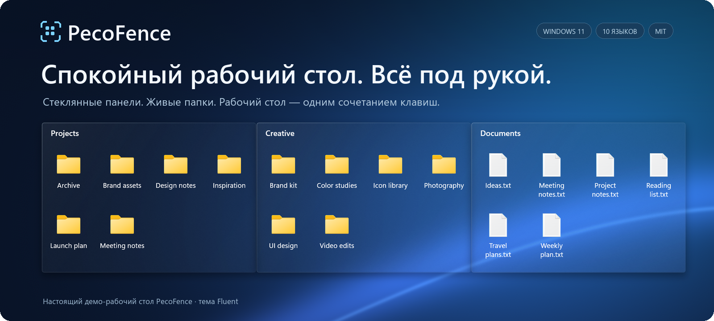

<p align="center">
  
</p>


<p align="center">
  <strong>Бесплатная альтернатива Stardock Fences с открытым исходным кодом для Windows 11.</strong><br>
  Больше места для главного. Соберите файлы в стеклянные панели, переключайте проекты вкладками и вызывайте рабочий стол сочетанием клавиш. Бесплатно, с открытым кодом, для Windows 11. Или просто поручите это своему ИИ-агенту.
</p>

<p align="center">
  <a href="https://pecofence.jiang.jp/ru/"><strong>Сайт</strong></a>
  &nbsp;·&nbsp; <a href="#скачать-pecofence"><strong>Скачать PecoFence →</strong></a>
  &nbsp;·&nbsp; <a href="#pecofence-в-действии">Посмотреть в действии</a>
  &nbsp;·&nbsp; <a href="#попросите-свой-ии-навести-порядок">ИИ-агенты</a>
  &nbsp;·&nbsp; <a href="../README.md">Документация</a>
</p>

<p align="center">
  <a href="../../README.md">English</a>
  &nbsp;·&nbsp; <a href="README.zh-CN.md">简体中文</a>
  &nbsp;·&nbsp; <a href="README.zh-TW.md">繁體中文</a>
  &nbsp;·&nbsp; <a href="README.ja.md">日本語</a>
  &nbsp;·&nbsp; <a href="README.ko.md">한국어</a>
  &nbsp;·&nbsp; <a href="README.de.md">Deutsch</a>
  &nbsp;·&nbsp; <a href="README.fr.md">Français</a>
  &nbsp;·&nbsp; <a href="README.es.md">Español</a>
  &nbsp;·&nbsp; <a href="README.pt-BR.md">Português (Brasil)</a>
  &nbsp;·&nbsp; <strong>Русский</strong>
</p>

---

## Всему своё место

Проекты, скриншоты, статьи «на потом» — держите их в отдельных группах, расставленных так,
как вам удобно работать. PecoFence добавляет ровно столько порядка, чтобы рабочим столом
снова было приятно пользоваться.

| **Группируйте работу** | **Держите папки рядом** | **Освобождайте место** |
| :--- | :--- | :--- |
| Заведите по области на каждый проект. Перетаскивайте, растягивайте — она сама встанет на место. | Поставьте живую папку прямо на рабочий стол. Заглядывайте в подпапки и следите за изменениями в реальном времени. | Двойной щелчок по рабочему столу скрывает все области. Ещё один двойной щелчок возвращает их. |

## PecoFence в действии

https://github.com/user-attachments/assets/6320cf28-a791-4720-9659-b4575df021a0

### Одно окно. Несколько рабочих пространств.

Держите связанные области вместе как вкладки. Переключайтесь с Work на Art одним щелчком,
а когда нужно больше места — вытащите вкладку в отдельную область.


### Рабочий стол — в одном сочетании клавиш.

Нажмите **Ctrl + Alt + Пробел**, и области появятся поверх текущего приложения.
Возьмите нужное и нажмите **Esc**, чтобы вернуться.


<sub>Записано в PecoFence на демонстрационных файлах с темой Fluent. GIF воспроизводятся по кругу.</sub>

## Мелочи, из которых складывается удобство

| Возможность | Что это даёт |
| :--- | :--- |
| **Меньше ручной сортировки** | Правила по типу файла, расширению, имени, маске, цели ярлыка, времени и размеру. Новые файлы сами находят свою область. |
| **Стекло под ваш рабочий стол** | Темы Fluent и Liquid Glass, светлый и тёмный режимы, свой цвет для каждой области, непрозрачность и тонирование значков. |
| **Привычная работа с файлами** | Контекстные меню Проводника, перетаскивание, копирование и вставка, множественный выбор, эскизы и виды «Значки», «Список» и «Таблица». |
| **Место, когда оно нужно** | Сверните область до заголовка — она развернётся при наведении. Закрепите расположение, которое вам нравится. |
| **Путь назад** | Снимки расположения, ежедневные резервные копии, импорт и экспорт конфигурации, обмен областями между мониторами. |
| **Лёгкость** | Нативное приложение на Rust; панель настроек на WebView2 загружается только по запросу. |
| **Работает с вашим ИИ-агентом** | `pecofence-cli` общается в JSON, поэтому Claude Code, Codex или Cursor могут создавать области, перемещать значки и писать правила за вас. |

Автоматические правила не трогают сами файлы — те остаются на прежнем месте.
Перемещения, которые начинаете вы, работают так же, как в Проводнике.

[Полный список возможностей →](../FEATURES.md)

## Попросите свой ИИ навести порядок

В комплекте с PecoFence идёт `pecofence-cli` — командная строка, созданная для ИИ-агентов вроде Claude Code, Codex и Cursor. Каждая команда общается в JSON, сообщает, изменилось ли что-то на самом деле, и объясняет ошибки так, чтобы агент мог их исправить. Вы описываете, каким хотите видеть рабочий стол, — агент выполняет команды.

> «Собери все мои PDF в область Docs, следи, чтобы так и оставалось, и сделай области чуть прозрачнее».

```
pecofence-cli snapshot save before-cleanup
pecofence-cli fence create --title Docs --rect 100,100,600,400
pecofence-cli rule add --name PDFs --ext pdf --to Docs
pecofence-cli rule apply
pecofence-cli fence set --all opacity clear
```

Области, значки, правила, настройки, снимки и файлы конфигурации — всё доступно, а любой шаг можно отменить, вернувшись к снимку расположения. Чтобы подготовить агента, выполните `pecofence-cli skill` и сохраните вывод в его папку навыков или вставьте в свой `AGENTS.md` три строки, которые печатает команда. Издание из Microsoft Store добавляет `pecofence-cli` в PATH; портативный ZIP запускает его из своей папки.

[Справочник по командной строке →](../CLI.md)

## Говорит на вашем языке

**Русский · English · 简体中文 · 繁體中文 · 日本語**  
**한국어 · Deutsch · Français · Español · Português (Brasil)**

Переключайте язык мгновенно в **Настройки → Общие → Язык интерфейса** или следуйте языку Windows.
Все переводы встроены и работают офлайн. Имена файлов и заданные вами названия остаются без изменений.

## Скачать PecoFence

<a href="https://apps.microsoft.com/detail/9MV6WG3XNWSX?mode=direct"></a>

Версия из Microsoft Store подписана Microsoft, обновляется автоматически и не показывает предупреждение SmartScreen. Нужен просто ZIP? Портативная сборка ниже — то же приложение.

1. Откройте страницу **Releases** этого репозитория и скачайте `pecofence-<версия>-x64.zip`.
2. Распакуйте **весь ZIP-архив** в папку и запустите `pecofence.exe`.
3. Начинайте наводить порядок. Настройки и выход — по правому щелчку на значке в трее.

Предпочитаете пакетный менеджер? `winget install DayuanJiang.PecoFence` устанавливает ту же портативную сборку и не вызывает предупреждение SmartScreen.

**Windows 11 x64 · Портативный ZIP · Без учётной записи · Лицензия Apache 2.0**

При первом запуске появятся области «Программы», «Папки», «Файлы и документы» и «Рабочий стол»
на выбранном языке. При выходе значки рабочего стола Windows возвращаются на место.

<details>
<summary><strong>Требования, конфигурация и несколько полезных замечаний</strong></summary>

- Рассчитано на Windows 11 22H2 и новее. Основное тестирование проходило на 25H2;
  полная проверка на более старых версиях и с несколькими мониторами ещё продолжается.
- Для настроек нужен Microsoft Edge WebView2 Runtime. Держите `WebView2Loader.dll`
  и `pecofence-watchdog.exe` из архива рядом с приложением.
- Конфигурация хранится в `%APPDATA%\PecoFence\config.json`. Запустите с параметром
  `--portable`, чтобы хранить её в папке `config` рядом с исполняемым файлом.
- Существующие установки продолжают использовать прежний каталог конфигурации.
  См. [руководство по обновлению](../UPGRADING.md).
- Стекло использует статичные обои рабочего стола. Оно не преломляет окна других приложений
  и видеообои.
- Системные диалоги Windows и сторонние пункты меню Проводника отображаются на языке Windows.
- Портативные сборки не подписаны. Если при первом запуске появится Windows SmartScreen, выберите
  **Подробнее → Выполнить в любом случае**. При установке из Microsoft Store или через winget предупреждения нет.

[Портативная версия](../PORTABLE.md) · [Языки и переводы](../LOCALIZATION.md)

</details>

## Соберите сами. Сделайте своим.

PecoFence распространяется под лицензией Apache 2.0, и мы рады любому вкладу — от более точного
перевода до более удобного взаимодействия с рабочим столом.

[Как помочь проекту](../../CONTRIBUTING.md) · [Улучшить перевод](../LOCALIZATION.md) · [Руководство разработчика](../DEVELOPMENT.md)

<details>
<summary><strong>Сборка из исходного кода</strong></summary>

Установите Rust stable и Visual Studio Build Tools с рабочей нагрузкой C++ и Windows SDK.

```powershell
cargo build --locked --release
Copy-Item third_party/webview2/WebView2Loader.x64.dll target/release/WebView2Loader.dll
```

Собрать портативный ZIP для распространения:

```powershell
./scripts/make-portable.ps1
```

Рабочее пространство разделено на `crates/` — нативное приложение, `ui/` — настройки,
`locales/` — переводы и `scripts/` — скрипты проверки и упаковки.
Необязательный видеопроект в `extras/` от сборки приложения не зависит.

[Инструкции по выпуску](../RELEASING.md) · [Структура исходников](../DEVELOPMENT.md#architecture)

</details>

---

**Для рабочего стола, к которому приятно возвращаться.**  
[Лицензия Apache 2.0](../../LICENSE) · [Сторонние компоненты](../../third_party/README.md)
