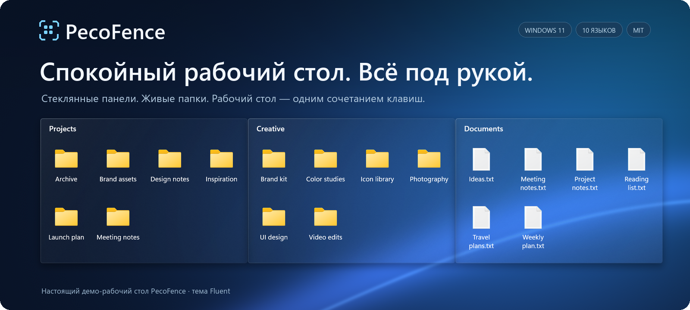

https://github.com/user-attachments/assets/c827f059-cfd7-4f6a-bed3-8b00411a7220

<p align="center">
  <strong>Бесплатная альтернатива Stardock Fences с открытым исходным кодом для Windows 11.</strong><br>
  Собирайте файлы в стеклянных панелях, переключайте проекты вкладками и поручите ИИ настройку расположения, внешнего вида и правил сортировки через встроенный CLI.
</p>

<p align="center">
  <a href="https://pecofence.jiang.jp/ru/"><strong>Сайт</strong></a>
  &nbsp;·&nbsp; <a href="#скачать-pecofence"><strong>Скачать PecoFence →</strong></a>
  &nbsp;·&nbsp; <a href="#ваш-рабочий-стол-настроит-ваш-ии"><strong>ИИ + CLI</strong></a>
  &nbsp;·&nbsp; <a href="#pecofence-в-действии">Посмотреть в действии</a>
  &nbsp;·&nbsp; <a href="../README.md">Документация</a>
</p>

<p align="center">
  <a href="../../README.md">English</a>
  &nbsp;·&nbsp; <a href="README.zh-CN.md">简体中文</a>
  &nbsp;·&nbsp; <a href="README.zh-TW.md">繁體中文</a>
  &nbsp;·&nbsp; <a href="README.ja.md">日本語</a>
  &nbsp;·&nbsp; <a href="README.ko.md">한국어</a>
  &nbsp;·&nbsp; <a href="README.de.md">Deutsch</a>
  &nbsp;·&nbsp; <a href="README.fr.md">Français</a>
  &nbsp;·&nbsp; <a href="README.es.md">Español</a>
  &nbsp;·&nbsp; <a href="README.pt-BR.md">Português (Brasil)</a>
  &nbsp;·&nbsp; <strong>Русский</strong>
</p>

---

<a id="попросите-свой-ии-навести-порядок"></a>

## Ваш рабочий стол настроит ваш ИИ

**CLI в комплекте. Готов к работе с ИИ.**

Расскажите ИИ-агенту, как вы хотите пользоваться рабочим столом. Через входящий в комплект `pecofence-cli` агенты Claude Code, Codex и Cursor могут прочитать текущую конфигурацию и применить изменения прямо в PecoFence.

- **Настраивайте своими словами.** Меняйте тему, прозрачность, размер значков и общие настройки или все области сразу.
- **Наведите порядок и сохраняйте его автоматически.** Создавайте области для проектов, распределяйте значки и добавляйте правила сортировки новых файлов.
- **Сохраните удобную конфигурацию.** Снимки сохраняют расположение областей, а экспорт и импорт конфигурации — настройки, правила и расположение.

**Попробуйте со своим ИИ-агентом**

Запустите PecoFence и вставьте этот запрос в чат с ИИ-агентом для программирования:

> Настрой мой рабочий стол через pecofence-cli. Сначала прочитай pecofence-cli skill и pecofence-cli describe, затем проверь текущие настройки и области. Перед изменениями сохрани резервную копию конфигурации. Включи тёмный режим и сделай все области прозрачнее.

CLI уже в комплекте. Версия из Microsoft Store добавляет `pecofence-cli` в PATH. Для портативного ZIP укажите агенту полный путь к `pecofence-cli.exe`.

<details>
<summary><strong>Пример разговора с ИИ-агентом</strong></summary>

> Собери PDF с рабочего стола в область Docs и автоматически направляй туда новые PDF. Включи тёмный режим и сделай области прозрачнее.

```powershell
pecofence-cli config export "$env:USERPROFILE\pecofence-before-ai.json"
pecofence-cli snapshot save before-cleanup
pecofence-cli fence create --title Docs
pecofence-cli rule add --name PDFs --ext pdf --to Docs --index 0
pecofence-cli rule apply
pecofence-cli settings set theme dark
pecofence-cli fence set --all opacity clear
```

</details>

Для агентов и скриптов: `describe` выводит каталог команд и схемы JSON, а `skill` — руководство для агента. Результаты JSON показывают изменения, а структурированные ошибки приложения помогают выбрать следующий шаг.

[Начало работы с CLI →](../CLI.md#start-with-your-ai-agent)

## Всему своё место

<p align="center">
  
</p>

## PecoFence в действии

### Одно окно. Несколько рабочих пространств.

Объединяйте связанные области во вкладки. Переключайтесь с Project на Ideas одним щелчком,
а когда нужно больше места — вытащите вкладку в отдельную область.


### Рабочий стол — в одном сочетании клавиш.

Нажмите **Ctrl + Alt + Пробел**, и области появятся поверх текущего приложения.
Возьмите нужное и нажмите **Esc**, чтобы вернуться.


<sub>Анимации из <a href="https://pecofence.jiang.jp/ru/manual/">руководства</a>. GIF воспроизводятся по кругу.</sub>

## Мелочи, из которых складывается удобство

| Возможность | Что это даёт |
| :--- | :--- |
| **ИИ + CLI** | `pecofence-cli` — **Настраивайте своими словами.** Меняйте тему, прозрачность, размер значков и общие настройки или все области сразу. |
| **Меньше ручной сортировки** | Правила по типу файла, расширению, имени, маске, объекту ярлыка, времени и размеру. Новые файлы сами находят свою область. |
| **Стекло под ваш рабочий стол** | Темы Fluent и Liquid Glass, светлый и тёмный режимы, свой цвет для каждой области, непрозрачность и тонирование значков. |
| **Привычная работа с файлами** | Контекстные меню Проводника, перетаскивание, копирование и вставка, множественный выбор, эскизы и виды «Значки», «Список» и «Таблица». |
| **Держите папки рядом** | Поставьте живую папку прямо на рабочий стол. Заглядывайте в подпапки и следите за изменениями в реальном времени. |
| **Место, когда оно нужно** | Сверните область до заголовка — она развернётся при наведении. Закрепите расположение, которое вам нравится. Двойной щелчок по рабочему столу скрывает все области. Ещё один двойной щелчок возвращает их. |
| **Всё можно вернуть** | Снимки расположения, ежедневные резервные копии, импорт и экспорт конфигурации, обмен областями между мониторами. |
| **Лёгкость** | Нативное приложение на Rust, которое в простое занимает около 40 МБ памяти (по данным диспетчера задач). Панель настроек на WebView2 загружается только по запросу. |

Автоматические правила не трогают сами файлы — те остаются на прежнем месте.
Перемещения, которые начинаете вы, работают так же, как в Проводнике.

[Полный список возможностей →](../FEATURES.md)

## Скачать PecoFence

<a href="https://apps.microsoft.com/detail/9MV6WG3XNWSX?mode=direct"></a>

Версия из Microsoft Store подписана Microsoft, обновляется автоматически и не показывает предупреждение SmartScreen. То же приложение доступно и в других вариантах:

- **Портативный ZIP**: скачайте `pecofence-v<версия>-x64-portable.zip` со страницы **Releases** этого репозитория, распакуйте **весь ZIP-архив** в папку и запустите `pecofence.exe`.
- **Установщик**: `pecofence-v<версия>-x64-setup.exe` на той же странице устанавливает PecoFence для вашей учётной записи Windows и добавляет ярлык в меню «Пуск» и программу удаления.
- **winget**: `winget install DayuanJiang.PecoFence` устанавливает портативную сборку и не вызывает предупреждение SmartScreen.

<details>
<summary><strong>Требования, конфигурация и несколько полезных замечаний</strong></summary>

- Windows 11 22H2 или новее. Для настроек нужен Microsoft Edge WebView2 Runtime.
- При первом запуске появятся области «Программы», «Папки», «Файлы и документы» и «Рабочий стол» на выбранном языке. При выходе значки рабочего стола Windows возвращаются на место.
- Конфигурация хранится в `%APPDATA%\PecoFence\config.json`. Запустите с параметром `--portable`, чтобы хранить её в папке `config` рядом с исполняемым файлом.
- ZIP и установщик не подписаны. Если при первом запуске появится Windows SmartScreen, выберите **Подробнее → Выполнить в любом случае**.

[Руководство по портативной версии](../PORTABLE.md) · [Языки и переводы](../LOCALIZATION.md) · [Руководство по установке в Windows](../INSTALLER.md)

</details>

## Соберите сами. Сделайте своим.

PecoFence распространяется под лицензией Apache 2.0, и мы рады любому вкладу — от более точного
перевода до более удобного взаимодействия с рабочим столом.

[Как помочь проекту](../../CONTRIBUTING.md) · [Улучшить перевод](../LOCALIZATION.md) · [Руководство разработчика](../DEVELOPMENT.md)

---

**Для рабочего стола, к которому приятно возвращаться.**  
[Лицензия Apache 2.0](../../LICENSE) · [Сторонние компоненты](../../third_party/README.md)
