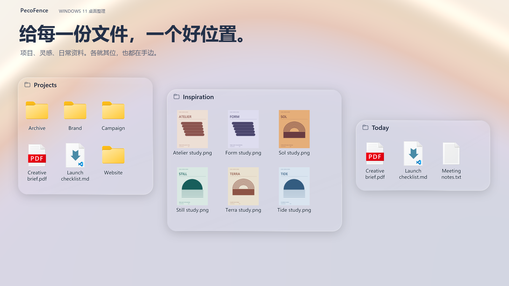

<p align="center">
  
</p>


<p align="center">
  <strong>免费、开源的 Windows 11 桌面整理工具，Stardock Fences 的另一种选择。</strong><br>
  用玻璃栅栏收好文件，用标签页切换项目，还能让 AI 助手通过内置 CLI，直接调整布局、外观和自动整理规则。
</p>

<p align="center">
  <a href="https://pecofence.jiang.jp/zh-CN/"><strong>官网</strong></a>
  &nbsp;·&nbsp; <a href="#开始使用"><strong>下载使用 →</strong></a>
  &nbsp;·&nbsp; <a href="#桌面怎么配告诉-ai-就好"><strong>AI + CLI</strong></a>
  &nbsp;·&nbsp; <a href="#看看它怎么用">看看实际操作</a>
  &nbsp;·&nbsp; <a href="../README.md">项目文档</a>
</p>

<p align="center">
  <a href="../../README.md">English</a>
  &nbsp;·&nbsp; <strong>简体中文</strong>
  &nbsp;·&nbsp; <a href="README.zh-TW.md">繁體中文</a>
  &nbsp;·&nbsp; <a href="README.ja.md">日本語</a>
  &nbsp;·&nbsp; <a href="README.ko.md">한국어</a>
  &nbsp;·&nbsp; <a href="README.de.md">Deutsch</a>
  &nbsp;·&nbsp; <a href="README.fr.md">Français</a>
  &nbsp;·&nbsp; <a href="README.es.md">Español</a>
  &nbsp;·&nbsp; <a href="README.pt-BR.md">Português (Brasil)</a>
  &nbsp;·&nbsp; <a href="README.ru.md">Русский</a>
</p>

---

<a id="让-ai-帮你整理"></a>

## 桌面怎么配，告诉 AI 就好

**内置 CLI，让 AI 直接配置桌面**

把你想要的桌面告诉 AI 助手。PecoFence 自带 `pecofence-cli`，Claude Code、Codex、Cursor 可以读取当前配置，并直接在 PecoFence 中执行修改。

- **说出需求，直接改配置。** 切换主题、透明度、图标大小和全局设置，也能一次调整所有栅栏。
- **整理一次，以后自动归位。** 创建项目栅栏、整理图标，再添加规则，让新文件自动进入对应栅栏。
- **喜欢的配置，保存下来。** 用快照保存栅栏布局，用配置导入导出保存和恢复设置、规则与布局。

**现在就让你的 AI 助手试试**

启动 PecoFence，把下面这段话发给你的 AI 编程助手：

> 请用 pecofence-cli 帮我配置桌面。先阅读 pecofence-cli skill 和 pecofence-cli describe，再查看当前设置与栅栏。修改前先备份配置，然后切换为深色模式，并把所有栅栏调得更透明。

CLI 已随应用附带。Microsoft Store 版会把 `pecofence-cli` 加入 PATH；使用便携版时，告诉助手 `pecofence-cli.exe` 的完整路径即可。

<details>
<summary><strong>与编程助手的对话示例</strong></summary>

> 把桌面上的 PDF 放进 Docs 栅栏，以后的 PDF 也自动归进去，切成深色模式，再把栅栏调得更透明一点。

```powershell
pecofence-cli config export "$env:USERPROFILE\pecofence-before-ai.json"
pecofence-cli snapshot save before-cleanup
pecofence-cli fence create --title Docs
pecofence-cli rule add --name PDFs --ext pdf --to Docs --index 0
pecofence-cli rule apply
pecofence-cli settings set theme dark
pecofence-cli fence set --all opacity clear
```

</details>

为 AI 和脚本提供清晰接口：`describe` 输出命令目录与 JSON Schema，`skill` 输出使用指南。JSON 结果报告实际改动，结构化的应用错误帮助助手决定下一步。

[查看 CLI 上手指南 →](../CLI.md#start-with-your-ai-agent)

## 给每件事，留一个位置

正在做的项目、刚存下的截图、准备晚点看的资料——各自放进一个栅栏，
按你的习惯摆好。桌面上的东西依然顺手，也终于有了秩序。

| **按项目收好** | **把文件夹放在手边** | **随时让出空间** |
| :--- | :--- | :--- |
| 给工作、设计或常用资料各建一个栅栏，拖动、缩放、吸附对齐。 | 把真实文件夹变成桌面上的窗口；可以进入子文件夹，内容变化自动同步。 | 双击桌面空白处隐藏全部栅栏，再次双击恢复。需要文件时叫回来，想看壁纸时收起来。 |

## 看看它怎么用

https://github.com/user-attachments/assets/6320cf28-a791-4720-9659-b4575df021a0

### 一个窗口，几种工作状态

把相关栅栏合成标签页，点一下就能从 Work 切到 Art。
需要同时看两组文件时，把标签拖出来，就变回两个独立栅栏。


### 文件就在当前应用前面

按 **Ctrl + Alt + 空格**，所有栅栏浮现在当前应用上方。
取用需要的文件后，按 **Esc** 回去接着工作。


<sub>以上为 PecoFence 的实际操作录制，使用演示文件和 Fluent 主题。动图会自动循环。</sub>

## 日常好用，藏在这些细节里

| 体验 | 能做什么 |
| :--- | :--- |
| **AI + CLI** | `pecofence-cli` — **说出需求，直接改配置。** 切换主题、透明度、图标大小和全局设置，也能一次调整所有栅栏。 |
| **少一点手动整理** | 按类型、扩展名、名称、通配符、快捷方式目标、时间和大小设置规则，新文件自动找到位置。 |
| **配得上你的壁纸** | Fluent 与 Liquid Glass 两种风格，支持深浅色、单独色调、不透明度和图标着色。 |
| **熟悉的文件操作** | 资源管理器右键菜单、拖放、复制粘贴、多选、缩略图，以及图标／列表／详细信息视图。 |
| **用时展开，闲时收好** | 把栅栏卷成标题条，鼠标悬停即可展开；也可以锁定已经摆好的位置。 |
| **喜欢的布局，留得住** | 保存布局快照、每日自动备份、导入导出配置、交换两个显示器上的栅栏。 |
| **轻巧地待在桌面上** | Rust 编写的原生应用，WebView2 设置面板按需加载。 |

自动整理只改变文件所属的栅栏，保留文件原来的位置。
你主动发起的移动、重命名和删除，则像资源管理器一样操作真实文件。

[查看完整功能清单 →](../FEATURES.md)

## 用你熟悉的语言

**简体中文 · 繁體中文 · English · 日本語 · 한국어**  
**Deutsch · Français · Español · Português (Brasil) · Русский**

在 **设置 → 常规 → 显示语言** 中即时切换，也可以跟随 Windows。
翻译已经内置，离线可用；文件名和你自己起的名称保持不变。

## 开始使用

<a href="https://apps.microsoft.com/detail/9MV6WG3XNWSX?mode=direct"></a>

Microsoft Store 版由微软签名，自动更新，不会出现 SmartScreen 提示。想要纯压缩包？下面的便携版是同一个程序。

1. 在本仓库的 **Releases** 页面下载 `pecofence-<版本>-x64.zip`。
2. **完整解压**到一个文件夹，运行 `pecofence.exe`。
3. 开始整理。需要设置或退出时，右键系统托盘里的 PecoFence 图标。

习惯用包管理器？`winget install DayuanJiang.PecoFence` 安装的是同一个便携版，并且不会触发 SmartScreen 提示。

**Windows 11 x64 · 便携版 · 无需账号 · Apache 2.0 开源**

首次运行会按所选语言创建“程序”“文件夹”“文件与文档”和“桌面”四个栅栏。
退出程序时，Windows 桌面图标会恢复显示。

<details>
<summary><strong>系统要求、配置位置与使用说明</strong></summary>

- 面向 Windows 11 22H2 及以上版本，目前主要在 25H2 上完成原生验证；
  旧版本 Windows 和多显示器硬件组合的完整回归仍在进行。
- 设置面板需要 Microsoft Edge WebView2 Runtime。
  请将压缩包里的 `WebView2Loader.dll`、`pecofence-watchdog.exe` 与主程序放在一起。
- 配置保存在 `%APPDATA%\PecoFence\config.json`。
  用 `--portable` 启动，可改为保存在程序旁的 `config` 文件夹。
- 已有安装会继续使用旧配置目录，保留布局、规则和备份。详见[升级说明](../UPGRADING.md)。
- 玻璃效果采样静态桌面壁纸，不会折射其他应用窗口或视频壁纸。
- Windows 自带对话框和第三方资源管理器菜单仍使用系统语言。
- 便携版未做代码签名。首次运行若出现 Windows SmartScreen 提示，点击**更多信息 → 仍要运行**。通过 Microsoft Store 或 winget 安装不会出现该提示。

[便携版说明](../PORTABLE.md) · [多语言说明](../LOCALIZATION.md)

</details>

## 开源，也欢迎你的想法

改进一句翻译、修好一次拖拽、让某个日常操作更顺手，都很欢迎。

[参与贡献](../../CONTRIBUTING.md) · [完善翻译](../LOCALIZATION.md) · [开发文档](../DEVELOPMENT.md)

<details>
<summary><strong>从源码构建</strong></summary>

安装 Rust stable、Visual Studio Build Tools 的 C++ 工作负载和 Windows SDK，然后运行：

```powershell
cargo build --locked --release
Copy-Item third_party/webview2/WebView2Loader.x64.dll target/release/WebView2Loader.dll
```

生成便携发布包：

```powershell
./scripts/make-portable.ps1
```

原生应用位于 `crates/`，设置面板在 `ui/`，翻译在 `locales/`，
验证与打包脚本在 `scripts/`。产品网站在 `site/`，`extras/` 下的宣传视频工程不参与应用构建。

[发布指南](../RELEASING.md) · [源码结构](../DEVELOPMENT.md#architecture)

</details>

---

**让每次回到桌面，都更舒服一点。**  
[Apache 2.0 许可证](../../LICENSE) · [第三方许可说明](../../third_party/README.md)
