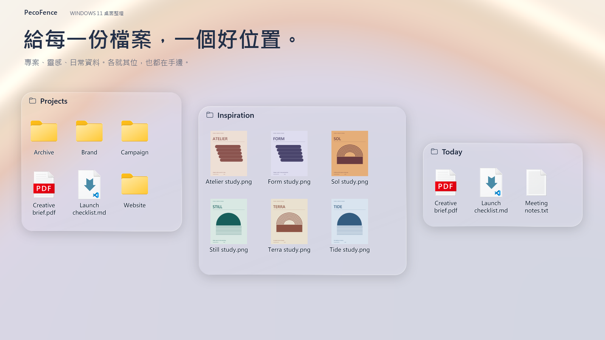

https://github.com/user-attachments/assets/c827f059-cfd7-4f6a-bed3-8b00411a7220

<p align="center">
  <strong>免費、開源的 Windows 11 桌面整理工具，可以取代 Stardock Fences。</strong><br>
  用玻璃圍欄收好檔案，用分頁切換專案，也能讓 AI 助理透過內建 CLI，直接調整圍欄配置、外觀與自動整理規則。
</p>

<p align="center">
  <a href="https://pecofence.jiang.jp/zh-TW/"><strong>官方網站</strong></a>
  &nbsp;·&nbsp; <a href="#開始使用"><strong>下載使用 →</strong></a>
  &nbsp;·&nbsp; <a href="#桌面怎麼設告訴-ai-就好"><strong>AI + CLI</strong></a>
  &nbsp;·&nbsp; <a href="#看看它怎麼用">看看實際操作</a>
  &nbsp;·&nbsp; <a href="../README.md">專案文件</a>
</p>

<p align="center">
  <a href="../../README.md">English</a>
  &nbsp;·&nbsp; <a href="README.zh-CN.md">简体中文</a>
  &nbsp;·&nbsp; <strong>繁體中文</strong>
  &nbsp;·&nbsp; <a href="README.ja.md">日本語</a>
  &nbsp;·&nbsp; <a href="README.ko.md">한국어</a>
  &nbsp;·&nbsp; <a href="README.de.md">Deutsch</a>
  &nbsp;·&nbsp; <a href="README.fr.md">Français</a>
  &nbsp;·&nbsp; <a href="README.es.md">Español</a>
  &nbsp;·&nbsp; <a href="README.pt-BR.md">Português (Brasil)</a>
  &nbsp;·&nbsp; <a href="README.ru.md">Русский</a>
</p>

---

<a id="讓-ai-幫你整理"></a>

## 桌面怎麼設，告訴 AI 就好

**內建 CLI，讓 AI 直接設定桌面**

把你想要的桌面告訴 AI 助理。PecoFence 隨附 `pecofence-cli`，Claude Code、Codex、Cursor 可以讀取目前設定，並直接在 PecoFence 中執行修改。

- **說出需求，直接改設定。** 切換主題，調整透明度、圖示大小與全域設定，也能一次改好所有圍欄。
- **整理一次，之後自動歸位。** 建立專案圍欄、整理圖示，再新增規則，讓新檔案自動進入對應圍欄。
- **喜歡的設定，儲存下來。** 用快照儲存圍欄配置；匯出設定檔則能保存並還原設定、規則與配置。

**現在就讓你的 AI 助理試試**

啟動 PecoFence，把下面這段話交給你的 AI 程式設計助理：

> 請用 pecofence-cli 幫我設定桌面。先閱讀 pecofence-cli skill 和 pecofence-cli describe，再查看目前的設定與圍欄。修改前先備份設定，然後切換為深色模式，並把所有圍欄調得更透明。

CLI 已隨應用程式附帶。Microsoft Store 版會將 `pecofence-cli` 加入 PATH；使用免安裝版時，告訴助理 `pecofence-cli.exe` 的完整路徑即可。

<details>
<summary><strong>與 AI 程式設計助理的對話範例</strong></summary>

> 把桌面上的 PDF 放進 Docs 圍欄，之後的 PDF 也自動歸進去，切換成深色模式，再把圍欄調得更透明一些。

```powershell
pecofence-cli config export "$env:USERPROFILE\pecofence-before-ai.json"
pecofence-cli snapshot save before-cleanup
pecofence-cli fence create --title Docs
pecofence-cli rule add --name PDFs --ext pdf --to Docs --index 0
pecofence-cli rule apply
pecofence-cli settings set theme dark
pecofence-cli fence set --all opacity clear
```

</details>

為 AI 與指令碼而設計：`describe` 輸出指令目錄與 JSON Schema，`skill` 輸出使用指南。每次執行都以 JSON 回報改了什麼；出錯時回傳結構化錯誤，助理可據此決定下一步。

[查看 CLI 入門指南 →](../CLI.md#start-with-your-ai-agent)

## 給每件事留一個位置

手上的專案、剛存下的截圖、打算晚點再看的資料——各自放進一個圍欄，
照你的習慣擺好。桌面上的東西依然順手，也終於有了秩序。

<p align="center">
  
</p>

| **依專案收好** | **把資料夾放在手邊** | **隨時讓出空間** |
| :--- | :--- | :--- |
| 為工作、設計或常用資料各建一個圍欄，拖曳、縮放、自動貼齊。 | 把真實的資料夾變成桌面上的視窗；可以進入子資料夾，內容一有變動就自動同步。 | 在桌面空白處按兩下就隱藏全部圍欄，再按兩下就恢復。要用檔案時叫回來，想看桌布時收起來。 |

## 看看它怎麼用

### 一個圍欄，切換多個專案

把相關的圍欄合併成分頁，點一下就能從 Project 切到 Ideas。
需要同時看兩組檔案時，把分頁拖出來，就變回兩個獨立的圍欄。


### 檔案就在目前應用程式前面

按下 **Ctrl + Alt + 空白鍵** 預覽圍欄，所有圍欄會顯示在目前的應用程式上方。
拿到需要的檔案後，按 **Esc** 回去繼續工作。


<sub>動畫取自<a href="https://pecofence.jiang.jp/zh-TW/manual/">使用手冊</a>，會自動重複播放。</sub>

## 好用之處藏在細節裡

| 體驗 | 能做什麼 |
| :--- | :--- |
| **AI + CLI** | `pecofence-cli` — **說出需求，直接改設定。** 切換主題，調整透明度、圖示大小與全域設定，也能一次改好所有圍欄。 |
| **少一點手動整理** | 依類型、副檔名、名稱、萬用字元、捷徑目標、時間和大小設定規則，新檔案會自動找到自己的位置。 |
| **配得上你的桌布** | Fluent 與 Liquid Glass 兩種風格，支援淺色／深色模式；每個圍欄可各自設定色調與不透明度，還能為圖示著色。 |
| **熟悉的檔案操作** | 檔案總管右鍵選單、拖放、複製貼上、多選、縮圖，以及圖示／清單／詳細資料三種檢視。 |
| **要用時展開，不用時收合** | 把圍欄收合成一條標題列，滑鼠停留就展開；也可以鎖定已經擺好的位置與大小。 |
| **喜歡的配置留得住** | 儲存配置快照、每日自動備份、匯入匯出設定、交換兩個顯示器上的圍欄。 |
| **輕巧地待在桌面上** | 以 Rust 撰寫的原生應用程式，閒置時記憶體用量約 40 MB（工作管理員顯示）。WebView2 設定面板需要時才載入。 |

自動整理只改變檔案所屬的圍欄，檔案原本的位置不會變動。
你自己發起的移動、重新命名和刪除，則和檔案總管一樣直接作用在真實檔案上。

[查看完整功能清單 →](../FEATURES.md)

## 開始使用

<a href="https://apps.microsoft.com/detail/9MV6WG3XNWSX?mode=direct"></a>

Microsoft Store 版由微軟簽署、自動更新，不會出現 SmartScreen 提示。想要純壓縮檔？下面的免安裝版是同一個程式。

1. 到本儲存庫的 **Releases** 頁面下載 `pecofence-v<版本>-x64-portable.zip`。
2. 把壓縮檔**完整解壓縮**到一個資料夾，執行 `pecofence.exe`。
3. 開始整理。需要開啟設定或結束程式時，在系統匣的 PecoFence 圖示上按右鍵。

想用安裝程式？同一頁面上的 `pecofence-v<版本>-x64-setup.exe` 只替目前的使用者安裝，會加入開始功能表項目和解除安裝程式，設定與 ZIP 版共用。

習慣用套件管理器？`winget install DayuanJiang.PecoFence` 安裝的是同一個免安裝版，而且不會觸發 SmartScreen 提示。

**Windows 11 x64 · 記憶體約 40 MB · 免安裝版 · 不需帳號 · Apache 2.0 開源授權**

第一次執行時，會依所選語言建立「程式」「資料夾」「檔案與文件」和「桌面」四個圍欄。
結束程式時，Windows 桌面圖示會恢復顯示。

<details>
<summary><strong>系統需求、設定檔位置與使用說明</strong></summary>

- 支援 Windows 11 22H2 以上版本。目前主要在 25H2 上測試，
  舊版 Windows 與各種多螢幕組合仍在陸續測試中。
- 設定面板需要 Microsoft Edge WebView2 Runtime。
  請將壓縮檔內的 `WebView2Loader.dll`、`pecofence-watchdog.exe` 與主程式放在同一個資料夾。
- 設定儲存在 `%APPDATA%\PecoFence\config.json`。
  以 `--portable` 啟動，可改為儲存在程式旁的 `config` 資料夾。
- 從舊版升級會沿用原本的設定目錄，配置、規則與備份都會保留。詳見[升級說明](../UPGRADING.md)。
- 玻璃效果只取自靜態桌布，不會透出其他應用程式的視窗，也不支援動態桌布。
- Windows 內建的對話方塊與第三方的檔案總管選單項目仍使用系統語言。
- 免安裝版沒有程式碼簽章。首次執行若出現 Windows SmartScreen 提示，請點選**其他資訊 → 仍要執行**。透過 Microsoft Store 或 winget 安裝不會出現此提示。

[免安裝版說明](../PORTABLE.md) · [多語言說明](../LOCALIZATION.md) · [Windows 安裝版說明](../INSTALLER.md)

</details>

## 歡迎一起讓它更好

改進一句翻譯、修好一次拖曳、讓某個日常操作更順手，都非常歡迎。

[參與貢獻](../../CONTRIBUTING.md) · [改善翻譯](../LOCALIZATION.md) · [開發文件](../DEVELOPMENT.md)

<details>
<summary><strong>從原始碼建置</strong></summary>

安裝 Rust stable、Visual Studio Build Tools 的 C++ 工作負載與 Windows SDK，然後執行：

```powershell
cargo build --locked --release
Copy-Item third_party/webview2/WebView2Loader.x64.dll target/release/WebView2Loader.dll
```

產生免安裝版發行套件：

```powershell
./scripts/make-portable.ps1
```

原生應用程式位於 `crates/`，設定面板在 `ui/`，翻譯在 `locales/`，
驗證與打包指令碼在 `scripts/`。產品網站在 `site/`，`extras/` 下的宣傳影片專案不參與應用程式的建置。

[發行指南](../RELEASING.md) · [原始碼結構](../DEVELOPMENT.md#architecture)

</details>

---

**讓每次回到桌面，都更舒服一點。**  
[Apache 2.0 授權條款](../../LICENSE) · [第三方授權聲明](../../third_party/README.md)
